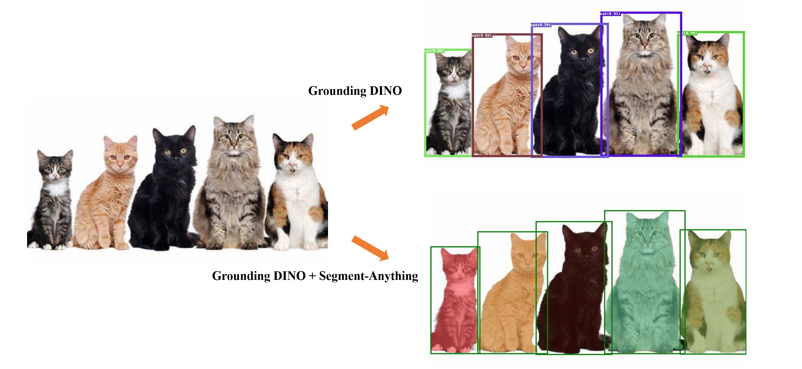

# Grounded-Segment-Anything
We plan to create a very interesting demo by combining [Grounding DINO](https://arxiv.org/abs/2303.05499) and [Segment Anything](https://ai.facebook.com/research/publications/segment-anything/)! Right now, this is just a simple small project. We will continue to improve it and create more interesting demos.




## Highlight
- Detect and Segment everything with Language!


## Catelog
- [x] GroundingDINO + Segment-Anything Demo
- [ ] Huggingface Demo
- [ ] Colab demo

## Installation
The code requires `python>=3.8`, as well as `pytorch>=1.7` and `torchvision>=0.8`. Please follow the instructions [here](https://pytorch.org/get-started/locally/) to install both PyTorch and TorchVision dependencies. Installing both PyTorch and TorchVision with CUDA support is strongly recommended.

Install Segment Anything:

```bash
python -m pip install -e segment_anything
```

Install GroundingDINO:

```bash
python -m pip install -e GroundingDINO
```

The following optional dependencies are necessary for mask post-processing, saving masks in COCO format, the example notebooks, and exporting the model in ONNX format. `jupyter` is also required to run the example notebooks.
```
pip install opencv-python pycocotools matplotlib onnxruntime onnx ipykernel
```

More details can be found in [install segment anything](https://github.com/facebookresearch/segment-anything#installation) and [install GroundingDINO](https://github.com/IDEA-Research/GroundingDINO#install)


## Run GroundingDINO Demo
- Download the checkpoint for groundingdino:
```bash
cd Grounded-Segment-Anything

wget https://github.com/IDEA-Research/GroundingDINO/releases/download/v0.1.0-alpha/groundingdino_swint_ogc.pth
```

- Run demo
```bash
export CUDA_VISIBLE_DEVICES=0
python grounding_dino_demo.py \
  --config GroundingDINO/groundingdino/config/GroundingDINO_SwinT_OGC.py \
  --grounded_checkpoint groundingdino_swint_ogc.pth \
  --input_image assets/demo1.jpg \
  --output_dir "outputs" \
  --box_threshold 0.3 \
  --text_threshold 0.25 \
  --text_prompt "bear" \
  --device "cuda"
```
- The model prediction visualization will be saved in `output_dir` as follow:


## Run Grounded-Segment-Anything Demo
- Download the checkpoint for segment-anything and grounding-dino:
```bash
cd Grounded-Segment-Anything

wget https://dl.fbaipublicfiles.com/segment_anything/sam_vit_h_4b8939.pth
wget https://github.com/IDEA-Research/GroundingDINO/releases/download/v0.1.0-alpha/groundingdino_swint_ogc.pth
```

- Run Demo
```bash
export CUDA_VISIBLE_DEVICES=0
python grounded_sam_demo.py \
  --config GroundingDINO/groundingdino/config/GroundingDINO_SwinT_OGC.py \
  --grounded_checkpoint groundingdino_swint_ogc.pth \
  --sam_checkpoint sam_vit_h_4b8939.pth \
  --input_image assets/demo1.jpg \
  --output_dir "outputs" \
  --box_threshold 0.3 \
  --text_threshold 0.25 \
  --text_prompt "bear" \
  --device "cuda"
```

- The model prediction visualization will be saved in `output_dir` as follow:

