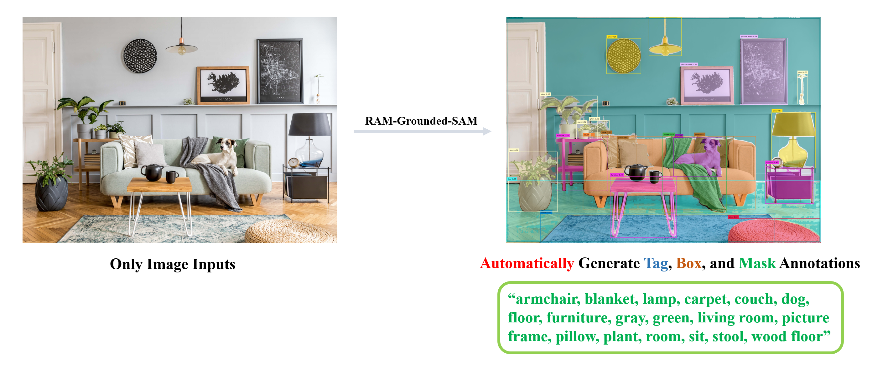
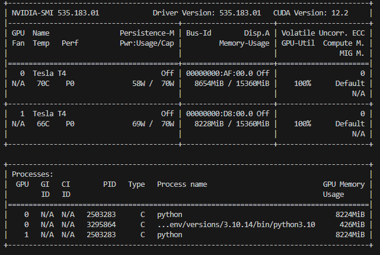
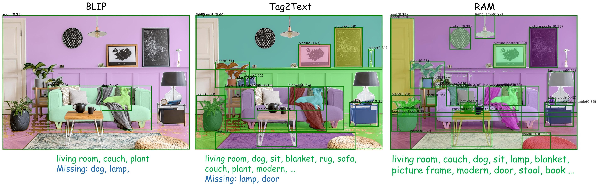

# Grounded-Segment-Anything
[](https://youtu.be/oEQYStnF2l8) [](https://colab.research.google.com/github/roboflow-ai/notebooks/blob/main/notebooks/automated-dataset-annotation-and-evaluation-with-grounding-dino-and-sam.ipynb) [](https://github.com/camenduru/grounded-segment-anything-colab) [](https://huggingface.co/spaces/IDEA-Research/Grounded-SAM) [](https://replicate.com/cjwbw/grounded-recognize-anything)  [](https://modelscope.cn/studios/tuofeilunhifi/Grounded-Segment-Anything/summary) [](https://huggingface.co/spaces/yizhangliu/Grounded-Segment-Anything) [](https://github.com/continue-revolution/sd-webui-segment-anything) [](./grounded_sam.ipynb) [](https://arxiv.org/abs/2303.05499) [](https://arxiv.org/abs/2304.02643) [](https://arxiv.org/abs/2401.14159)


We plan to create a very interesting demo by combining [Grounding DINO](https://github.com/IDEA-Research/GroundingDINO) and [Segment Anything](https://github.com/facebookresearch/segment-anything) which aims to detect and segment anything with text inputs! And we will continue to improve it and create more interesting demos based on this foundation. And we have already released an overall technical report about our project on arXiv, please check [Grounded SAM: Assembling Open-World Models for Diverse Visual Tasks](https://arxiv.org/abs/2401.14159) for more details.

- 🔥 **[Grounded SAM 2](https://github.com/IDEA-Research/Grounded-SAM-2)** is released now, which combines Grounding DINO with [SAM 2](https://github.com/facebookresearch/segment-anything-2) for any object tracking in open-world scenarios.
- 🔥 **[Grounding DINO 1.5](https://github.com/IDEA-Research/Grounding-DINO-1.5-API)** is released now, which is IDEA Research's **Most Capable** Open-World Object Detection Model!
- 🔥 **[Grounding DINO](https://arxiv.org/abs/2303.05499)** and **[Grounded SAM](https://arxiv.org/abs/2401.14159)** are now supported in Huggingface. For more convenient use, you can refer to [this documentation](https://huggingface.co/docs/transformers/model_doc/grounding-dino)

We are very willing to **help everyone share and promote new projects** based on Segment-Anything, Please check out here for more amazing demos and works in the community: [Highlight Extension Projects](#highlighted-projects). You can submit a new issue (with `project` tag) or a new pull request to add new project's links. 




**🍄 Why Building this Project?**

The **core idea** behind this project is to **combine the strengths of different models in order to build a very powerful pipeline for solving complex problems**. And it's worth mentioning that this is a workflow for combining strong expert models, where **all parts can be used separately or in combination, and can be replaced with any similar but different models (like replacing Grounding DINO with GLIP or other detectors / replacing Stable-Diffusion with ControlNet or GLIGEN/ Combining with ChatGPT)**.

**🍇 Updates**
- **`2024/01/26`** We have released a comprehensive technical report about our project on arXiv, please check [Grounded SAM: Assembling Open-World Models for Diverse Visual Tasks](https://arxiv.org/abs/2401.14159) for more details. And we are profoundly grateful for the contributions of all the contributors in this project.
- **`2023/12/17`** Support [Grounded-RepViT-SAM](https://github.com/IDEA-Research/Grounded-Segment-Anything/tree/main/EfficientSAM#run-grounded-repvit-sam-demo) demo, thanks a lot for their great work!
- **`2023/12/16`** Support [Grounded-Edge-SAM](https://github.com/IDEA-Research/Grounded-Segment-Anything/tree/main/EfficientSAM#run-grounded-edge-sam-demo) demo, thanks a lot for their great work!
- **`2023/12/10`** Support [Grounded-Efficient-SAM](https://github.com/IDEA-Research/Grounded-Segment-Anything/tree/main/EfficientSAM#run-grounded-efficient-sam-demo) demo, thanks a lot for their great work!
- **`2023/11/24`** Release [RAM++](https://arxiv.org/abs/2310.15200), which is the next generation of RAM. RAM++ can recognize any category with high accuracy, including both predefined common categories and diverse open-set categories.
- **`2023/11/23`** Release our newly proposed visual prompt counting model [T-Rex](https://github.com/IDEA-Research/T-Rex). The introduction [Video](https://www.youtube.com/watch?v=engIEhZogAQ) and [Demo](https://deepdataspace.com/playground/ivp) is available in [DDS](https://github.com/IDEA-Research/deepdataspace) now.
- **`2023/07/25`** Support [Light-HQ-SAM](https://github.com/SysCV/sam-hq) in [EfficientSAM](./EfficientSAM/), credits to [Mingqiao Ye](https://github.com/ymq2017) and [Lei Ke](https://github.com/lkeab), thanks a lot for their great work!
- **`2023/07/14`** Combining **Grounding-DINO-B** with [SAM-HQ](https://github.com/SysCV/sam-hq) achieves **49.6 mean AP** in [Segmentation in the Wild](https://eval.ai/web/challenges/challenge-page/1931/overview) competition zero-shot track, surpassing Grounded-SAM by **3.6 mean AP**, thanks for their great work!
- **`2023/06/28`** Combining Grounding-DINO with Efficient SAM variants including [FastSAM](https://github.com/CASIA-IVA-Lab/FastSAM) and [MobileSAM](https://github.com/ChaoningZhang/MobileSAM) in [EfficientSAM](./EfficientSAM/) for faster annotating, thanks a lot for their great work!
- **`2023/06/20`** By combining **Grounding-DINO-L** with **SAM-ViT-H**, Grounded-SAM achieves 46.0 mean AP in [Segmentation in the Wild](https://eval.ai/web/challenges/challenge-page/1931/overview) competition zero-shot track on [CVPR 2023 workshop](https://computer-vision-in-the-wild.github.io/cvpr-2023/), surpassing [UNINEXT (CVPR 2023)](https://github.com/MasterBin-IIAU/UNINEXT) by about **4 mean AP**.
- **`2023/06/16`** Release [RAM-Grounded-SAM Replicate Online Demo](https://replicate.com/cjwbw/ram-grounded-sam). Thanks a lot to [Chenxi](https://chenxwh.github.io/) for providing this nice demo 🌹.
- **`2023/06/14`** Support [RAM-Grounded-SAM & SAM-HQ](./automatic_label_ram_demo.py) and update [Simple Automatic Label Demo](./automatic_label_ram_demo.py) to support [RAM](https://github.com/OPPOMKLab/recognize-anything), setting up a strong automatic annotation pipeline.
- **`2023/06/13`** Checkout the [Autodistill: Train YOLOv8 with ZERO Annotations](https://youtu.be/gKTYMfwPo4M) tutorial to learn how to use Grounded-SAM + [Autodistill](https://github.com/autodistill/autodistill) for automated data labeling and real-time model training.
- **`2023/06/13`** Support [SAM-HQ](https://github.com/SysCV/sam-hq) in [Grounded-SAM Demo](#running_man-grounded-sam-detect-and-segment-everything-with-text-prompt) for higher quality prediction.
- **`2023/06/12`** Support [RAM-Grounded-SAM](#label-grounded-sam-with-ram-or-tag2text-for-automatic-labeling) for strong automatic labeling pipeline! Thanks for [Recognize-Anything](https://github.com/OPPOMKLab/recognize-anything).
- **`2023/06/01`** Our Grounded-SAM has been accepted to present a **demo** at [ICCV 2023](https://iccv2023.thecvf.com/)! See you in Paris!
- **`2023/05/23`**: Support `Image-Referring-Segment`, `Audio-Referring-Segment` and `Text-Referring-Segment` in [ImageBind-SAM](./playground/ImageBind_SAM/).
- **`2023/05/03`**: Checkout the [Automated Dataset Annotation and Evaluation with GroundingDINO and SAM](https://colab.research.google.com/github/roboflow-ai/notebooks/blob/main/notebooks/automated-dataset-annotation-and-evaluation-with-grounding-dino-and-sam.ipynb) which is an amazing tutorial on automatic labeling! Thanks a lot for [Piotr Skalski](https://github.com/SkalskiP) and [Roboflow](https://github.com/roboflow/notebooks)!


## Table of Contents
- [Grounded-Segment-Anything](#grounded-segment-anything)
  - [Preliminary Works](#preliminary-works)
  - [Highlighted Projects](#highlighted-projects)
- [Installation](#installation)
  - [Install with Docker](#install-with-docker)
  - [Install locally](#install-without-docker)
- [Grounded-SAM Playground](#grounded-sam-playground)
  - [Step-by-Step Notebook Demo](#open_book-step-by-step-notebook-demo)
  - [GroundingDINO: Detect Everything with Text Prompt](#running_man-groundingdino-detect-everything-with-text-prompt)
  - [Grounded-SAM: Detect and Segment Everything with Text Prompt](#running_man-grounded-sam-detect-and-segment-everything-with-text-prompt)
  - [Grounded-SAM with Inpainting: Detect, Segment and Generate Everything with Text Prompt](#skier-grounded-sam-with-inpainting-detect-segment-and-generate-everything-with-text-prompt)
  - [Grounded-SAM and Inpaint Gradio APP](#golfing-grounded-sam-and-inpaint-gradio-app)
  - [Grounded-SAM with RAM or Tag2Text for Automatic Labeling](#label-grounded-sam-with-ram-or-tag2text-for-automatic-labeling)
  - [Grounded-SAM with BLIP & ChatGPT for Automatic Labeling](#robot-grounded-sam-with-blip-for-automatic-labeling)
  - [Grounded-SAM with Whisper: Detect and Segment Anything with Audio](#open_mouth-grounded-sam-with-whisper-detect-and-segment-anything-with-audio)
  - [Grounded-SAM ChatBot with Visual ChatGPT](#speech_balloon-grounded-sam-chatbot-demo)
  - [Grounded-SAM with OSX for 3D Whole-Body Mesh Recovery](#man_dancing-run-grounded-segment-anything--osx-demo)
  - [Grounded-SAM with VISAM for Tracking and Segment Anything](#man_dancing-run-grounded-segment-anything--visam-demo)
  - [Interactive Fashion-Edit Playground: Click for Segmentation And Editing](#dancers-interactive-editing)
  - [Interactive Human-face Editing Playground: Click And Editing Human Face](#dancers-interactive-editing)
  - [3D Box Via Segment Anything](#camera-3d-box-via-segment-anything)
  - [Playground: More Interesting and Imaginative Demos with Grounded-SAM](./playground/)
    - [DeepFloyd: Image Generation with Text Prompt](./playground/DeepFloyd/)
    - [PaintByExample: Exemplar-based Image Editing with Diffusion Models](./playground/PaintByExample/)
    - [LaMa: Resolution-robust Large Mask Inpainting with Fourier Convolutions](./playground/LaMa/)
    - [RePaint: Inpainting using Denoising Diffusion Probabilistic Models](./playground/RePaint/)
    - [ImageBind with SAM: Segment with Different Modalities](./playground/ImageBind_SAM/)
  - [Efficient SAM Series for Faster Annotation](./EfficientSAM/)
    - [Grounded-FastSAM Demo](https://github.com/IDEA-Research/Grounded-Segment-Anything/tree/main/EfficientSAM#run-grounded-fastsam-demo)
    - [Grounded-MobileSAM Demo](https://github.com/IDEA-Research/Grounded-Segment-Anything/tree/main/EfficientSAM#run-grounded-mobilesam-demo)
    - [Grounded-Light-HQSAM Demo](https://github.com/IDEA-Research/Grounded-Segment-Anything/tree/main/EfficientSAM#run-grounded-light-hqsam-demo)
    - [Grounded-Efficient-SAM Demo](https://github.com/IDEA-Research/Grounded-Segment-Anything/tree/main/EfficientSAM#run-grounded-efficient-sam-demo)
    - [Grounded-Edge-SAM Demo](https://github.com/IDEA-Research/Grounded-Segment-Anything/tree/main/EfficientSAM#run-grounded-edge-sam-demo)
    - [Grounded-RepViT-SAM Demo](https://github.com/IDEA-Research/Grounded-Segment-Anything/tree/main/EfficientSAM#run-grounded-repvit-sam-demo)
- [Citation](#citation)

## Preliminary Works

Here we provide some background knowledge that you may need to know before trying the demos.

<div align="center">

| Title | Intro | Description | Links |
|:----:|:----:|:----:|:----:|
| [Segment-Anything](https://arxiv.org/abs/2304.02643) |  | A strong foundation model aims to segment everything in an image, which needs prompts (as boxes/points/text) to generate masks | [[Github](https://github.com/facebookresearch/segment-anything)] <br> [[Page](https://segment-anything.com/)] <br> [[Demo](https://segment-anything.com/demo)] |
| [Grounding DINO](https://arxiv.org/abs/2303.05499) |  | A strong zero-shot detector which is capable of to generate high quality boxes and labels with free-form text. | [[Github](https://github.com/IDEA-Research/GroundingDINO)] <br> [[Demo](https://huggingface.co/spaces/ShilongLiu/Grounding_DINO_demo)] |
| [OSX](http://arxiv.org/abs/2303.16160) |  | A strong and efficient one-stage motion capture method to generate high quality 3D human mesh from monucular image. OSX also releases a large-scale upper-body dataset UBody for a more accurate reconstrution in the upper-body scene. | [[Github](https://github.com/IDEA-Research/OSX)] <br> [[Page](https://osx-ubody.github.io/)] <br> [[Video](https://osx-ubody.github.io/)] <br> [[Data](https://docs.google.com/forms/d/e/1FAIpQLSehgBP7wdn_XznGAM2AiJPiPLTqXXHw5uX9l7qeQ1Dh9HoO_A/viewform)] |
| [Stable-Diffusion](https://arxiv.org/abs/2112.10752) |  | A super powerful open-source latent text-to-image diffusion model | [[Github](https://github.com/CompVis/stable-diffusion)] <br> [[Page](https://ommer-lab.com/research/latent-diffusion-models/)] |
| [RAM++](https://arxiv.org/abs/2310.15200) |  | RAM++ is the next generation of RAM, which can recognize any category with high accuracy. | [[Github](https://github.com/OPPOMKLab/recognize-anything)] |
| [RAM](https://recognize-anything.github.io/) |  | RAM is an image tagging model, which can recognize any common category with high accuracy. | [[Github](https://github.com/OPPOMKLab/recognize-anything)] <br> [[Demo](https://huggingface.co/spaces/xinyu1205/Recognize_Anything-Tag2Text)] |
| [BLIP](https://arxiv.org/abs/2201.12086) |  | A wonderful language-vision model for image understanding. | [[GitHub](https://github.com/salesforce/LAVIS)] |
| [Visual ChatGPT](https://arxiv.org/abs/2303.04671) |  | A wonderful tool that connects ChatGPT and a series of Visual Foundation Models to enable sending and receiving images during chatting. | [[Github](https://github.com/microsoft/TaskMatrix)] <br> [[Demo](https://huggingface.co/spaces/microsoft/visual_chatgpt)] |
| [Tag2Text](https://tag2text.github.io/) |  | An efficient and controllable vision-language model which can simultaneously output superior image captioning and image tagging. | [[Github](https://github.com/OPPOMKLab/recognize-anything)] <br> [[Demo](https://huggingface.co/spaces/xinyu1205/Tag2Text)] |
| [VoxelNeXt](https://arxiv.org/abs/2303.11301) |  | A clean, simple, and fully-sparse 3D object detector, which predicts objects directly upon sparse voxel features. | [[Github](https://github.com/dvlab-research/VoxelNeXt)] 

</div>

## Highlighted Projects

Here we provide some impressive works you may find interesting:

<div align="center">

| Title | Description | Links |
|:---:|:---:|:---:|
| [Semantic-SAM](https://github.com/UX-Decoder/Semantic-SAM) | A universal image segmentation model to enable segment and recognize anything at any desired granularity | [[Github](https://github.com/UX-Decoder/Semantic-SAM)] <br> [[Demo](https://github.com/UX-Decoder/Semantic-SAM)] |
| [SEEM: Segment Everything Everywhere All at Once](https://arxiv.org/pdf/2304.06718.pdf) | A powerful promptable segmentation model supports segmenting with various types of prompts (text, point, scribble, referring image, etc.) and any combination of prompts. | [[Github](https://github.com/UX-Decoder/Segment-Everything-Everywhere-All-At-Once)] <br> [[Demo](https://huggingface.co/spaces/xdecoder/SEEM)] |
| [OpenSeeD](https://arxiv.org/pdf/2303.08131.pdf) | A simple framework for open-vocabulary segmentation and detection which supports interactive segmentation with box input to generate mask | [[Github](https://github.com/IDEA-Research/OpenSeeD)] |
| [LLaVA](https://arxiv.org/abs/2304.08485) | Visual instruction tuning with GPT-4 | [[Github](https://github.com/haotian-liu/LLaVA)] <br> [[Page](https://llava-vl.github.io/)] <br> [[Demo](https://llava.hliu.cc/)] <br> [[Data](https://huggingface.co/datasets/liuhaotian/LLaVA-Instruct-150K)] <br> [[Model](https://huggingface.co/liuhaotian/LLaVA-13b-delta-v0)] |
| [GenSAM](https://arxiv.org/abs/2312.07374) | Relaxing the instance-specific manual prompt requirement in SAM through training-free test-time adaptation | [[Github](https://github.com/jyLin8100/GenSAM)] <br> [[Page](https://lwpyh.github.io/GenSAM/)] |

</div>

We also list some awesome segment-anything extension projects here you may find interesting:
- [Computer Vision in the Wild (CVinW) Readings](https://github.com/Computer-Vision-in-the-Wild/CVinW_Readings) for those who are interested in open-set tasks in computer vision.
- [Zero-Shot Anomaly Detection](https://github.com/caoyunkang/GroundedSAM-zero-shot-anomaly-detection) by Yunkang Cao
- [EditAnything: ControlNet + StableDiffusion based on the SAM segmentation mask](https://github.com/sail-sg/EditAnything) by Shanghua Gao and Pan Zhou
- [IEA: Image Editing Anything](https://github.com/feizc/IEA) by Zhengcong Fei
- [SAM-MMRorate: Combining Rotated Object Detector and SAM](https://github.com/Li-Qingyun/sam-mmrotate) by Qingyun Li and Xue Yang
- [Awesome-Anything](https://github.com/VainF/Awesome-Anything) by Gongfan Fang
- [Prompt-Segment-Anything](https://github.com/RockeyCoss/Prompt-Segment-Anything) by Rockey
- [WebUI for Segment-Anything and Grounded-SAM](https://github.com/continue-revolution/sd-webui-segment-anything) by Chengsong Zhang
- [Inpainting Anything: Inpaint Anything with SAM + Inpainting models](https://github.com/geekyutao/Inpaint-Anything) by Tao Yu
- [Grounded Segment Anything From Objects to Parts: Combining Segment-Anything with VLPart & GLIP & Visual ChatGPT](https://github.com/Cheems-Seminar/segment-anything-and-name-it) by Peize Sun and Shoufa Chen
- [Narapi-SAM: Integration of Segment Anything into Narapi (A nice viewer for SAM)](https://github.com/MIC-DKFZ/napari-sam) by MIC-DKFZ
- [Grounded Segment Anything Colab](https://github.com/camenduru/grounded-segment-anything-colab) by camenduru
- [Optical Character Recognition with Segment Anything](https://github.com/yeungchenwa/OCR-SAM) by Zhenhua Yang
- [Transform Image into Unique Paragraph with ChatGPT, BLIP2, OFA, GRIT, Segment Anything, ControlNet](https://github.com/showlab/Image2Paragraph) by showlab
- [Lang-Segment-Anything: Another awesome demo for combining GroundingDINO with Segment-Anything](https://github.com/luca-medeiros/lang-segment-anything) by Luca Medeiros
- [🥳 🚀 **Playground: Integrate SAM and OpenMMLab!**](https://github.com/open-mmlab/playground)
- [3D-object via Segment Anything](https://github.com/dvlab-research/3D-Box-Segment-Anything) by Yukang Chen
- [Image2Paragraph: Transform Image Into Unique Paragraph](https://github.com/showlab/Image2Paragraph) by Show Lab
- [Zero-shot Scene Graph Generate with Grounded-SAM](https://github.com/showlab/Image2Paragraph) by JackWhite-rwx
- [CLIP Surgery for Better Explainability with Enhancement in Open-Vocabulary Tasks](https://github.com/xmed-lab/CLIP_Surgery) by Eli-YiLi
- [Panoptic-Segment-Anything: Zero-shot panoptic segmentation using SAM](https://github.com/segments-ai/panoptic-segment-anything) by segments-ai
- [Caption-Anything: Generates Descriptive Captions for Any Object within an Image](https://github.com/ttengwang/Caption-Anything) by Teng Wang
- [Segment-Anything-3D: Transferring Segmentation Information of 2D Images to 3D Space](https://github.com/Pointcept/SegmentAnything3D) by Yunhan Yang
- [Expediting SAM without Fine-tuning](https://github.com/Expedit-LargeScale-Vision-Transformer/Expedit-SAM) by Weicong Liang and Yuhui Yuan
- [Semantic Segment Anything: Providing Rich Semantic Category Annotations for SAM](https://github.com/fudan-zvg/Semantic-Segment-Anything) by Jiaqi Chen and Zeyu Yang and Li Zhang
- [Enhance Everything: Combining SAM with Image Restoration and Enhancement Tasks](https://github.com/lixinustc/Enhance-Anything) by Xin Li
- [DragGAN](https://github.com/Zeqiang-Lai/DragGAN) by Shanghai AI Lab.
- [Tabletop HandyBot: Robotic arm assistant that performs tabletop tasks using Grounded-SAM](https://github.com/ycheng517/tabletop-handybot) by Yifei Cheng

## Installation
The code requires `python>=3.8`, as well as `pytorch>=1.7` and `torchvision>=0.8`. Please follow the instructions [here](https://pytorch.org/get-started/locally/) to install both PyTorch and TorchVision dependencies. Installing both PyTorch and TorchVision with CUDA support is strongly recommended.

### Install with Docker

Open one terminal:

```
make build-image
```

```
make run
```

That's it.

If you would like to allow visualization across docker container, open another terminal and type:

```
xhost +
```


### Install without Docker
You should set the environment variable manually as follows if you want to build a local GPU environment for Grounded-SAM:
```bash
export AM_I_DOCKER=False
export BUILD_WITH_CUDA=True
export CUDA_HOME=/path/to/cuda-11.3/
```

Install Segment Anything:

```bash
python -m pip install -e segment_anything
```

Install Grounding DINO:

```bash
pip install --no-build-isolation -e GroundingDINO
```


Install diffusers:

```bash
pip install --upgrade diffusers[torch]
```

Install osx:

```bash
git submodule update --init --recursive
cd grounded-sam-osx && bash install.sh
```

Install RAM & Tag2Text:

```bash
git clone https://github.com/xinyu1205/recognize-anything.git
pip install -r ./recognize-anything/requirements.txt
pip install -e ./recognize-anything/
```

The following optional dependencies are necessary for mask post-processing, saving masks in COCO format, the example notebooks, and exporting the model in ONNX format. `jupyter` is also required to run the example notebooks.

```
pip install opencv-python pycocotools matplotlib onnxruntime onnx ipykernel
```

More details can be found in [install segment anything](https://github.com/facebookresearch/segment-anything#installation) and [install GroundingDINO](https://github.com/IDEA-Research/GroundingDINO#install) and [install OSX](https://github.com/IDEA-Research/OSX)


## Grounded-SAM Playground
Let's start exploring our Grounding-SAM Playground and we will release more interesting demos in the future, stay tuned!

## :open_book: Step-by-Step Notebook Demo
Here we list some notebook demo provided in this project:
- [grounded_sam.ipynb](grounded_sam.ipynb)
- [grounded_sam_colab_demo.ipynb](grounded_sam_colab_demo.ipynb)
- [grounded_sam_3d_box.ipynb](grounded_sam_3d_box)


### :running_man: GroundingDINO: Detect Everything with Text Prompt

:grapes: [[arXiv Paper](https://arxiv.org/abs/2303.05499)] &nbsp; :rose:[[Try the Colab Demo](https://colab.research.google.com/github/roboflow-ai/notebooks/blob/main/notebooks/zero-shot-object-detection-with-grounding-dino.ipynb)] &nbsp; :sunflower: [[Try Huggingface Demo](https://huggingface.co/spaces/ShilongLiu/Grounding_DINO_demo)] &nbsp; :mushroom: [[Automated Dataset Annotation and Evaluation](https://youtu.be/C4NqaRBz_Kw)]

Here's the step-by-step tutorial on running `GroundingDINO` demo:

**Step 1: Download the pretrained weights**

```bash
cd Grounded-Segment-Anything

# download the pretrained groundingdino-swin-tiny model
wget https://github.com/IDEA-Research/GroundingDINO/releases/download/v0.1.0-alpha/groundingdino_swint_ogc.pth
```

**Step 2: Running the demo**

```bash
python grounding_dino_demo.py
```

<details>
<summary> <b> Running with Python (same as demo but you can run it anywhere after installing GroundingDINO) </b> </summary>

```python
from groundingdino.util.inference import load_model, load_image, predict, annotate
import cv2

model = load_model("GroundingDINO/groundingdino/config/GroundingDINO_SwinT_OGC.py", "./groundingdino_swint_ogc.pth")
IMAGE_PATH = "assets/demo1.jpg"
TEXT_PROMPT = "bear."
BOX_THRESHOLD = 0.35
TEXT_THRESHOLD = 0.25

image_source, image = load_image(IMAGE_PATH)

boxes, logits, phrases = predict(
    model=model,
    image=image,
    caption=TEXT_PROMPT,
    box_threshold=BOX_THRESHOLD,
    text_threshold=TEXT_THRESHOLD
)

annotated_frame = annotate(image_source=image_source, boxes=boxes, logits=logits, phrases=phrases)
cv2.imwrite("annotated_image.jpg", annotated_frame)
```

</details>
<br>

**Tips**
- If you want to detect multiple objects in one sentence with [Grounding DINO](https://github.com/IDEA-Research/GroundingDINO), we suggest separating each name with `.` . An example: `cat . dog . chair .`

**Step 3: Check the annotated image**

The annotated image will be saved as `./annotated_image.jpg`.

<div align="center">

| Text Prompt | Demo Image | Annotated Image |
|:----:|:----:|:----:|
| `Bear.` |   |  |
| `Horse. Clouds. Grasses. Sky. Hill` |   | 

</div>


### :running_man: Grounded-SAM: Detect and Segment Everything with Text Prompt

Here's the step-by-step tutorial on running `Grounded-SAM` demo:

**Step 1: Download the pretrained weights**

```bash
cd Grounded-Segment-Anything

wget https://dl.fbaipublicfiles.com/segment_anything/sam_vit_h_4b8939.pth
wget https://github.com/IDEA-Research/GroundingDINO/releases/download/v0.1.0-alpha/groundingdino_swint_ogc.pth
```

We provide two versions of Grounded-SAM demo here:
- [grounded_sam_demo.py](./grounded_sam_demo.py): our original implementation for Grounded-SAM.
- [grounded_sam_simple_demo.py](./grounded_sam_simple_demo.py) our updated more elegant version for Grounded-SAM.

**Step 2: Running original grounded-sam demo**
```bash
# depends on your device 
export CUDA_VISIBLE_DEVICES=0
```

```python

python grounded_sam_demo.py \
  --config GroundingDINO/groundingdino/config/GroundingDINO_SwinT_OGC.py \
  --grounded_checkpoint groundingdino_swint_ogc.pth \
  --sam_checkpoint sam_vit_h_4b8939.pth \
  --input_image assets/demo1.jpg \
  --output_dir "outputs" \
  --box_threshold 0.3 \
  --text_threshold 0.25 \
  --text_prompt "bear" \
  --device "cuda"
```

The annotated results will be saved in `./outputs` as follows

<div align="center">

| Input Image | Annotated Image | Generated Mask |
|:----:|:----:|:----:|
|  |  |  |

</div>

**Step 3: Running grounded-sam demo with sam-hq**
- Download the demo image
```bash
wget https://github.com/IDEA-Research/detrex-storage/releases/download/grounded-sam-storage/sam_hq_demo_image.png
```

- Download SAM-HQ checkpoint [here](https://github.com/SysCV/sam-hq#model-checkpoints)

- Running grounded-sam-hq demo as follows:
```python
export CUDA_VISIBLE_DEVICES=0
python grounded_sam_demo.py \
  --config GroundingDINO/groundingdino/config/GroundingDINO_SwinT_OGC.py \
  --grounded_checkpoint groundingdino_swint_ogc.pth \
  --sam_hq_checkpoint ./sam_hq_vit_h.pth \  # path to sam-hq checkpoint
  --use_sam_hq \  # set to use sam-hq model
  --input_image sam_hq_demo_image.png \
  --output_dir "outputs" \
  --box_threshold 0.3 \
  --text_threshold 0.25 \
  --text_prompt "chair." \
  --device "cuda"
```

The annotated results will be saved in `./outputs` as follows

<div align="center">

| Input Image | SAM Output | SAM-HQ Output |
|:----:|:----:|:----:|
|  |  |  |

</div>

**Step 4: Running the updated grounded-sam demo (optional)**

Note that this demo is almost same as the original demo, but **with more elegant code**.

```python
python grounded_sam_simple_demo.py
```

The annotated results will be saved as `./groundingdino_annotated_image.jpg` and `./grounded_sam_annotated_image.jpg`

<div align="center">

| Text Prompt | Input Image | GroundingDINO Annotated Image | Grounded-SAM Annotated Image |
|:----:|:----:|:----:|:----:|
| `The running dog` |  |  |  |
| `Horse. Clouds. Grasses. Sky. Hill` |  |  |  |

</div>

**Step 5: Running the Sam model with multi-gpu**
```bash
export CUDA_VISIBLE_DEVICES=0,1
```
```python

python grounded_sam_multi_gpu_demo.py \
  --config GroundingDINO/groundingdino/config/GroundingDINO_SwinT_OGC.py \
  --grounded_checkpoint groundingdino_swint_ogc.pth \
  --sam_checkpoint sam_vit_h_4b8939.pth \
  --input_path assets/car \
  --output_dir "outputs" \
  --box_threshold 0.3 \
  --text_threshold 0.25 \
  --text_prompt "car" \
  --device "cuda"
```
You will see that the model is loaded once per GPU  

### :skier: Grounded-SAM with Inpainting: Detect, Segment and Generate Everything with Text Prompt

**Step 1: Download the pretrained weights**

```bash
cd Grounded-Segment-Anything

wget https://dl.fbaipublicfiles.com/segment_anything/sam_vit_h_4b8939.pth
wget https://github.com/IDEA-Research/GroundingDINO/releases/download/v0.1.0-alpha/groundingdino_swint_ogc.pth
```

**Step 2: Running grounded-sam inpainting demo**

```bash
CUDA_VISIBLE_DEVICES=0
python grounded_sam_inpainting_demo.py \
  --config GroundingDINO/groundingdino/config/GroundingDINO_SwinT_OGC.py \
  --grounded_checkpoint groundingdino_swint_ogc.pth \
  --sam_checkpoint sam_vit_h_4b8939.pth \
  --input_image assets/inpaint_demo.jpg \
  --output_dir "outputs" \
  --box_threshold 0.3 \
  --text_threshold 0.25 \
  --det_prompt "bench" \
  --inpaint_prompt "A sofa, high quality, detailed" \
  --device "cuda"
```

The annotated and inpaint image will be saved in `./outputs`

**Step 3: Check the results**


<div align="center">

| Input Image | Det Prompt | Annotated Image | Inpaint Prompt | Inpaint Image |
|:---:|:---:|:---:|:---:|:---:|
| | `Bench` |  | `A sofa, high quality, detailed` |  |

</div>

### :golfing: Grounded-SAM and Inpaint Gradio APP

We support 6 tasks in the local Gradio APP：

1. **scribble**: Segmentation is achieved through Segment Anything and mouse click interaction (you need to click on the object with the mouse, no need to specify the prompt).
2. **automask**: Segment the entire image at once through Segment Anything (no need to specify a prompt).
3. **det**: Realize detection through Grounding DINO and text interaction (text prompt needs to be specified).
4. **seg**: Realize text interaction by combining Grounding DINO and Segment Anything to realize detection + segmentation (need to specify text prompt).
5. **inpainting**: By combining Grounding DINO + Segment Anything + Stable Diffusion to achieve text exchange and replace the target object (need to specify text prompt and inpaint prompt) .
6. **automatic**: By combining BLIP + Grounding DINO + Segment Anything to achieve non-interactive detection + segmentation (no need to specify prompt).

```bash
python gradio_app.py
```

- The gradio_app visualization as follows:


### :label: Grounded-SAM with RAM or Tag2Text for Automatic Labeling
[**The Recognize Anything Models**](https://github.com/OPPOMKLab/recognize-anything) are a series of open-source and strong fundamental image recognition models, including [RAM++](https://arxiv.org/abs/2310.15200), [RAM](https://arxiv.org/abs/2306.03514) and [Tag2text](https://arxiv.org/abs/2303.05657).


It is seamlessly linked to generate pseudo labels automatically as follows:
1. Use RAM/Tag2Text to generate tags.
2. Use Grounded-Segment-Anything to generate the boxes and masks.


**Step 1: Init submodule and download the pretrained checkpoint**

- Init submodule:

```bash
cd Grounded-Segment-Anything
git submodule init
git submodule update
```

- Download pretrained weights for `GroundingDINO`, `SAM` and `RAM/Tag2Text`:

```bash
wget https://dl.fbaipublicfiles.com/segment_anything/sam_vit_h_4b8939.pth
wget https://github.com/IDEA-Research/GroundingDINO/releases/download/v0.1.0-alpha/groundingdino_swint_ogc.pth


wget https://huggingface.co/spaces/xinyu1205/Tag2Text/resolve/main/ram_swin_large_14m.pth
wget https://huggingface.co/spaces/xinyu1205/Tag2Text/resolve/main/tag2text_swin_14m.pth
```

**Step 2: Running the demo with RAM**
```bash
export CUDA_VISIBLE_DEVICES=0
python automatic_label_ram_demo.py \
  --config GroundingDINO/groundingdino/config/GroundingDINO_SwinT_OGC.py \
  --ram_checkpoint ram_swin_large_14m.pth \
  --grounded_checkpoint groundingdino_swint_ogc.pth \
  --sam_checkpoint sam_vit_h_4b8939.pth \
  --input_image assets/demo9.jpg \
  --output_dir "outputs" \
  --box_threshold 0.25 \
  --text_threshold 0.2 \
  --iou_threshold 0.5 \
  --device "cuda"
```


**Step 2: Or Running the demo with Tag2Text**
```bash
export CUDA_VISIBLE_DEVICES=0
python automatic_label_tag2text_demo.py \
  --config GroundingDINO/groundingdino/config/GroundingDINO_SwinT_OGC.py \
  --tag2text_checkpoint tag2text_swin_14m.pth \
  --grounded_checkpoint groundingdino_swint_ogc.pth \
  --sam_checkpoint sam_vit_h_4b8939.pth \
  --input_image assets/demo9.jpg \
  --output_dir "outputs" \
  --box_threshold 0.25 \
  --text_threshold 0.2 \
  --iou_threshold 0.5 \
  --device "cuda"
```

- RAM++ significantly improves the open-set capability of RAM, for [RAM++ inference on unseen categoreis](https://github.com/xinyu1205/recognize-anything#ram-inference-on-unseen-categories-open-set).
- Tag2Text also provides powerful captioning capabilities, and the process with captions can refer to [BLIP](#robot-run-grounded-segment-anything--blip-demo).
- The pseudo labels and model prediction visualization will be saved in `output_dir` as follows (right figure):




### :robot: Grounded-SAM with BLIP for Automatic Labeling
It is easy to generate pseudo labels automatically as follows:
1. Use BLIP (or other caption models) to generate a caption.
2. Extract tags from the caption. We use ChatGPT to handle the potential complicated sentences. 
3. Use Grounded-Segment-Anything to generate the boxes and masks.

- Run Demo
```bash
export OPENAI_API_KEY=your_openai_key
export OPENAI_API_BASE=https://closeai.deno.dev/v1
export CUDA_VISIBLE_DEVICES=0
python automatic_label_demo.py \
  --config GroundingDINO/groundingdino/config/GroundingDINO_SwinT_OGC.py \
  --grounded_checkpoint groundingdino_swint_ogc.pth \
  --sam_checkpoint sam_vit_h_4b8939.pth \
  --input_image assets/demo3.jpg \
  --output_dir "outputs" \
  --openai_key $OPENAI_API_KEY \
  --box_threshold 0.25 \
  --text_threshold 0.2 \
  --iou_threshold 0.5 \
  --device "cuda"
```

- When you don't have a paid Account for ChatGPT is also possible to use NLTK instead. Just don't include the ```openai_key``` Parameter when starting the Demo.
  - The Script will automatically download the necessary NLTK Data.
- The pseudo labels and model prediction visualization will be saved in `output_dir` as follows:


### :open_mouth: Grounded-SAM with Whisper: Detect and Segment Anything with Audio
Detect and segment anything with speech!


**Install Whisper**
```bash
pip install -U openai-whisper
```
See the [whisper official page](https://github.com/openai/whisper#setup) if you have other questions for the installation.

**Run Voice-to-Label Demo**

Optional: Download the demo audio file

```bash
wget https://huggingface.co/ShilongLiu/GroundingDINO/resolve/main/demo_audio.mp3
```


```bash
export CUDA_VISIBLE_DEVICES=0
python grounded_sam_whisper_demo.py \
  --config GroundingDINO/groundingdino/config/GroundingDINO_SwinT_OGC.py \
  --grounded_checkpoint groundingdino_swint_ogc.pth \
  --sam_checkpoint sam_vit_h_4b8939.pth \
  --input_image assets/demo4.jpg \
  --output_dir "outputs" \
  --box_threshold 0.3 \
  --text_threshold 0.25 \
  --speech_file "demo_audio.mp3" \
  --device "cuda"
```


**Run Voice-to-inpaint Demo**

You can enable chatgpt to help you automatically detect the object and inpainting order with `--enable_chatgpt`. 

Or you can specify the object you want to inpaint [stored in `args.det_speech_file`] and the text you want to inpaint with [stored in `args.inpaint_speech_file`].

```bash
export OPENAI_API_KEY=your_openai_key
export OPENAI_API_BASE=https://closeai.deno.dev/v1
# Example: enable chatgpt
export CUDA_VISIBLE_DEVICES=0
python grounded_sam_whisper_inpainting_demo.py \
  --config GroundingDINO/groundingdino/config/GroundingDINO_SwinT_OGC.py \
  --grounded_checkpoint groundingdino_swint_ogc.pth \
  --sam_checkpoint sam_vit_h_4b8939.pth \
  --input_image assets/inpaint_demo.jpg \
  --output_dir "outputs" \
  --box_threshold 0.3 \
  --text_threshold 0.25 \
  --prompt_speech_file assets/acoustics/prompt_speech_file.mp3 \
  --enable_chatgpt \
  --openai_key $OPENAI_API_KEY\
  --device "cuda"
```

```bash
# Example: without chatgpt
export CUDA_VISIBLE_DEVICES=0
python grounded_sam_whisper_inpainting_demo.py \
  --config GroundingDINO/groundingdino/config/GroundingDINO_SwinT_OGC.py \
  --grounded_checkpoint groundingdino_swint_ogc.pth \
  --sam_checkpoint sam_vit_h_4b8939.pth \
  --input_image assets/inpaint_demo.jpg \
  --output_dir "outputs" \
  --box_threshold 0.3 \
  --text_threshold 0.25 \
  --det_speech_file "assets/acoustics/det_voice.mp3" \
  --inpaint_speech_file "assets/acoustics/inpaint_voice.mp3" \
  --device "cuda"
```


### :speech_balloon: Grounded-SAM ChatBot Demo

https://user-images.githubusercontent.com/24236723/231955561-2ae4ec1a-c75f-4cc5-9b7b-517aa1432123.mp4

Following [Visual ChatGPT](https://github.com/microsoft/visual-chatgpt), we add a ChatBot for our project. Currently, it supports:
1. "Describe the image."
2. "Detect the dog (and the cat) in the image."
3. "Segment anything in the image."
4. "Segment the dog (and the cat) in the image."
5. "Help me label the image."
6. "Replace the dog with a cat in the image."

To use the ChatBot:
- Install whisper if you want to use audio as input.
- Set the default model setting in the tool `Grounded_dino_sam_inpainting`.
- Run Demo
```bash
export OPENAI_API_KEY=your_openai_key
export OPENAI_API_BASE=https://closeai.deno.dev/v1
export CUDA_VISIBLE_DEVICES=0
python chatbot.py 
```

### :man_dancing: Run Grounded-Segment-Anything + OSX Demo

<p align="middle">

<br>
</p>


- Download the checkpoint `osx_l_wo_decoder.pth.tar` from [here](https://drive.google.com/drive/folders/1x7MZbB6eAlrq5PKC9MaeIm4GqkBpokow?usp=share_link) for OSX:
- Download the human model files and place it into `grounded-sam-osx/utils/human_model_files` following the instruction of [OSX](https://github.com/IDEA-Research/OSX).

- Run Demo

```shell
export CUDA_VISIBLE_DEVICES=0
python grounded_sam_osx_demo.py \
  --config GroundingDINO/groundingdino/config/GroundingDINO_SwinT_OGC.py \
  --grounded_checkpoint groundingdino_swint_ogc.pth \
  --sam_checkpoint sam_vit_h_4b8939.pth \
  --osx_checkpoint osx_l_wo_decoder.pth.tar \
  --input_image assets/osx/grounded_sam_osx_demo.png \
  --output_dir "outputs" \
  --box_threshold 0.3 \
  --text_threshold 0.25 \
  --text_prompt "humans, chairs" \
  --device "cuda"
```

- The model prediction visualization will be saved in `output_dir` as follows:


- We also support promptable 3D whole-body mesh recovery. For example, you can track someone with a text prompt  and estimate his 3D pose and shape :

|  |
| :---------------------------------------------------: |
|             *A person with pink clothes*              |

|  |
| :---------------------------------------------------: |
|               *A man with a sunglasses*               |


## :man_dancing: Run Grounded-Segment-Anything + VISAM Demo

- Download the checkpoint `motrv2_dancetrack.pth` from [here](https://drive.google.com/file/d/1EA4lndu2yQcVgBKR09KfMe5efbf631Th/view?usp=share_link) for MOTRv2:
- See the more thing if you have other questions for the installation.

- Run Demo

```shell
export CUDA_VISIBLE_DEVICES=0
python grounded_sam_visam.py \
  --meta_arch motr \
  --dataset_file e2e_dance \
  --with_box_refine \
  --query_interaction_layer QIMv2 \
  --num_queries 10 \
  --det_db det_db_motrv2.json \
  --use_checkpoint \
  --mot_path your_data_path \
  --resume motrv2_dancetrack.pth \
  --sam_checkpoint sam_vit_h_4b8939.pth \
  --video_path DanceTrack/test/dancetrack0003 
```
||


### :dancers: Interactive Editing
- Release the interactive fashion-edit playground in [here](https://github.com/IDEA-Research/Grounded-Segment-Anything/tree/humanFace). Run in the notebook, just click for annotating points for further segmentation. Enjoy it! 


- Release human-face-edit branch [here](https://github.com/IDEA-Research/Grounded-Segment-Anything/tree/humanFace). We'll keep updating this branch with more interesting features. Here are some examples:

  

## :camera: 3D-Box via Segment Anything
We extend the scope to 3D world by combining Segment Anything and [VoxelNeXt](https://github.com/dvlab-research/VoxelNeXt). When we provide a prompt (e.g., a point / box), the result is not only 2D segmentation mask, but also 3D boxes. Please check [voxelnext_3d_box](./voxelnext_3d_box/) for more details.
  
  


## :cupid: Acknowledgements

- [Segment Anything](https://github.com/facebookresearch/segment-anything)
- [Grounding DINO](https://github.com/IDEA-Research/GroundingDINO)


## Contributors

Our project wouldn't be possible without the contributions of these amazing people! Thank you all for making this project better.

<a href="https://github.com/IDEA-Research/Grounded-Segment-Anything/graphs/contributors">
  
</a>


## Citation
If you find this project helpful for your research, please consider citing the following BibTeX entry.
```BibTex
@article{kirillov2023segany,
  title={Segment Anything}, 
  author={Kirillov, Alexander and Mintun, Eric and Ravi, Nikhila and Mao, Hanzi and Rolland, Chloe and Gustafson, Laura and Xiao, Tete and Whitehead, Spencer and Berg, Alexander C. and Lo, Wan-Yen and Doll{\'a}r, Piotr and Girshick, Ross},
  journal={arXiv:2304.02643},
  year={2023}
}

@article{liu2023grounding,
  title={Grounding dino: Marrying dino with grounded pre-training for open-set object detection},
  author={Liu, Shilong and Zeng, Zhaoyang and Ren, Tianhe and Li, Feng and Zhang, Hao and Yang, Jie and Li, Chunyuan and Yang, Jianwei and Su, Hang and Zhu, Jun and others},
  journal={arXiv preprint arXiv:2303.05499},
  year={2023}
}

@misc{ren2024grounded,
      title={Grounded SAM: Assembling Open-World Models for Diverse Visual Tasks}, 
      author={Tianhe Ren and Shilong Liu and Ailing Zeng and Jing Lin and Kunchang Li and He Cao and Jiayu Chen and Xinyu Huang and Yukang Chen and Feng Yan and Zhaoyang Zeng and Hao Zhang and Feng Li and Jie Yang and Hongyang Li and Qing Jiang and Lei Zhang},
      year={2024},
      eprint={2401.14159},
      archivePrefix={arXiv},
      primaryClass={cs.CV}
}
```
