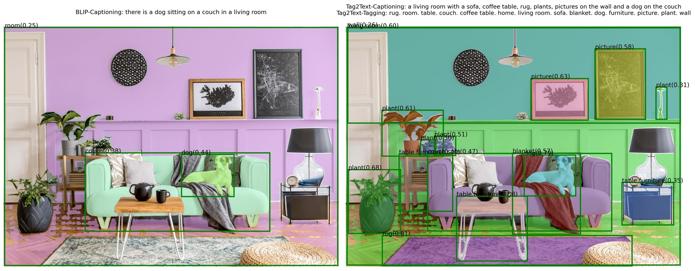

# Grounded-Segment-Anything
[](https://youtu.be/oEQYStnF2l8) [](https://colab.research.google.com/github/roboflow-ai/notebooks/blob/main/notebooks/automated-dataset-annotation-and-evaluation-with-grounding-dino-and-sam.ipynb) [](https://github.com/camenduru/grounded-segment-anything-colab) [](https://huggingface.co/spaces/IDEA-Research/Grounded-SAM) [](https://modelscope.cn/studios/tuofeilunhifi/Grounded-Segment-Anything/summary) [](https://huggingface.co/spaces/yizhangliu/Grounded-Segment-Anything) [](https://github.com/continue-revolution/sd-webui-segment-anything) [](./grounded_sam.ipynb)

We plan to create a very interesting demo by combining [Grounding DINO](https://github.com/IDEA-Research/GroundingDINO) and [Segment Anything](https://github.com/facebookresearch/segment-anything) which aims to detect and segment Anything with text inputs! And we will continue to improve it and create more interesting demos based on this foundation.

We are very willing to **help everyone share and promote new projects** based on Segment-Anything, Please checkout here for more amazing demos and works in the community: [Highlight Extension Projects](#bulb-highlight-extension-projects). You can submit a new issue (with `project` tag) or a new pull request to add new project's links. 

**🍄 Why Building this Project?**

The **core idea** behind this project is to **combine the strengths of different models in order to build a very powerful pipeline for solving complex problems**. And it's worth mentioning that this is a workflow for combining strong expert models, where **all parts can be used separately or in combination, and can be replaced with any similar but different models (like replacing Grounding DINO with GLIP or other detectors / replacing Stable-Diffusion with ControlNet or GLIGEN/ Combining with ChatGPT)**.

**🍇 Updates**
- **`2023/05/02`**: Release a better python API for GroundingDINO (annotate image less than 20 lines of code): please see [grounding_dino_demo.py](./grounding_dino_demo.py)
- **`2023/05/02`**: Release a more simple and elegant code for Grounded-SAM demo: please see [grounded_sam_simple_demo.py](./grounded_sam_simple_demo.py) 

**🍊 Preliminary Works**
- [Segment Anything](https://github.com/facebookresearch/segment-anything) is a strong segmentation model. But it needs prompts (like boxes/points) to generate masks. 
- [Grounding DINO](https://github.com/IDEA-Research/GroundingDINO) is a strong zero-shot detector which is capable of to generate high quality boxes and labels with free-form text. 
- [OSX](https://osx-ubody.github.io/) is a strong and efficient one-stage motion capture method to generate high quality 3D human mesh from monucular image. We also release a large-scale upper-body dataset UBody for a more accurate reconstrution in the upper-body scene.
- [Stable-Diffusion](https://github.com/CompVis/stable-diffusion) is an amazing strong text-to-image diffusion model.
- [Tag2Text](https://github.com/xinyu1205/Tag2Text) is an efficient and controllable vision-language model which can
simultaneously output superior image captioning and image tagging.
- [BLIP](https://github.com/salesforce/lavis) is a wonderful language-vision model for image understanding.
- [Visual ChatGPT](https://github.com/microsoft/visual-chatgpt) is a wonderful tool that connects ChatGPT and a series of Visual Foundation Models to enable sending and receiving images during chatting.
- [VoxelNeXt](https://github.com/dvlab-research/VoxelNeXt) is a clean, simple, and fully-sparse 3D object detector, which predicts objects directly upon sparse voxel features.


**🔥 Highlighted Projects** 

- Checkout the [Automated Dataset Annotation and Evaluation with GroundingDINO and SAM](https://colab.research.google.com/github/roboflow-ai/notebooks/blob/main/notebooks/automated-dataset-annotation-and-evaluation-with-grounding-dino-and-sam.ipynb) which is an amazing tutorial on automatic labeling! Thanks a lot for [Piotr Skalski](https://github.com/SkalskiP) and [Robotflow](https://github.com/roboflow/notebooks)!
- Checkout the [Segment Everything Everywhere All at Once](https://github.com/UX-Decoder/Segment-Everything-Everywhere-All-At-Once) demo! It supports segmenting with various types of prompts (text, point, scribble, referring image, etc.) and any combination of prompts.
- Checkout the [OpenSeeD](https://github.com/IDEA-Research/OpenSeeD) for the interactive segmentation with box input to generate mask.
- Visual instruction tuning with GPT-4! Please check out the multimodal model **LLaVA**: [[Project Page](https://llava-vl.github.io/)] [[Paper](https://arxiv.org/abs/2304.08485)] [[Demo](https://llava.hliu.cc/)]  [[Data](https://huggingface.co/datasets/liuhaotian/LLaVA-Instruct-150K)] [[Model](https://huggingface.co/liuhaotian/LLaVA-13b-delta-v0)]


**🍉 The Supported Amazing Demos in this Project**

- [GroundingDINO: Detect Everything with Text Prompt](#runner-run-grounding-dino-demo)
- [GroundingDINO + Segment-Anything: Detect and Segment Everything with Text Prompt](#runningman-run-grounded-segment-anything-demo)
- [GroundingDINO + Segment-Anything + Stable-Diffusion: Detect, Segment and Generate Anything with Text Prompts](#skier-run-grounded-segment-anything--inpainting-demo)
- [Grounded-SAM + Stable-Diffusion Gradio APP](#golfing-run-grounded-segment-anything--inpainting-gradio-app)
- [Grounded-SAM + Tag2Text: Automatically Labeling System with Superior Image Tagging!](#label-run-grounded-segment-anything--tag2text-demo)
- [Grounded-SAM + BLIP: Automatically Labeling System!](#robot-run-grounded-segment-anything--blip-demo)
- [Whisper + Grounded-SAM: Detect and Segment Everything with Speech!](#openmouth-run-grounded-segment-anything--whisper-demo)
- [Grounded-SAM + Visual ChatGPT: Automatically Label & Generate Everything with ChatBot!](#speechballoon-run-chatbot-demo)
- [Grounded-SAM + OSX: Text to 3D Whole-Body Mesh Recovery, Detect Anyone and Reconstruct his 3D Humen Mesh!](#mandancing-run-grounded-segment-anything--osx-demo)
- [Interactive Fashion-Edit Playground: Click for Segmentation And Editing!](https://github.com/IDEA-Research/Grounded-Segment-Anything/tree/humanFace)
- [Interactive Human-face Editing Playground: Click And Editing Human Face!](https://github.com/IDEA-Research/Grounded-Segment-Anything/tree/humanFace)


## The Amazing Demo Preview (Continual Updating)

**🔥 ChatBot for our project is built**

https://user-images.githubusercontent.com/24236723/231955561-2ae4ec1a-c75f-4cc5-9b7b-517aa1432123.mp4

**🔥 🔈Speak to edit🎨: Whisper + ChatGPT + Grounded-SAM + SD**


**🔥 Grounded-SAM: Semi-automatic Labeling System**


**Tips**
- If you want to detect multiple objects in one sentence with [Grounding DINO](https://github.com/IDEA-Research/GroundingDINO), we suggest seperating each name with `.` . An example: `cat . dog . chair .`

**🔥 Grounded-SAM + Stable-Diffusion Inpainting: Data-Factory, Generating New Data**


**🔥 Tag2Text + Grounded-SAM: Automatic Label System with Superior Image Tagging**

Using Tag2Text to directly generate tags, and using Grounded-SAM for box and mask generating. Tag2Text has superior tagging and captioning capabilities. Here's the demo output comparison:




**🔥 BLIP + Grounded-SAM: Automatic Label System**

Using BLIP to generate caption, extracting tags with ChatGPT, and using Grounded-SAM for box and mask generating. Here's the demo output:


**🔥 Grounded-SAM+OSX: Promptable 3D Whole-Body Human Mesh Recovery**

Using Grounded-SAM for box and mask generating, using [OSX](https://github.com/IDEA-Research/OSX) to estimate the SMPLX parameters and reconstruct 3D whole-body (body, face and hand) human mesh. Here's a demo:

<p align="middle">

<br>
</p>

**🔥 Interactive Editing**
- Release the interactive fashion-edit playground in [here](https://github.com/IDEA-Research/Grounded-Segment-Anything/tree/humanFace). Run in the notebook, just click for annotating points for further segmentation. Enjoy it! 


  

- Release human-face-edit branch [here](https://github.com/IDEA-Research/Grounded-Segment-Anything/tree/humanFace). We'll keep updating this branch with more interesting features. Here are some examples:

  

**🔥 3D-Box via Segment Anything**
We extend the scope to 3D world by combining Segment Anything and [VoxelNeXt](https://github.com/dvlab-research/VoxelNeXt). When we provide a prompt (e.g., a point / box), the result is not only 2D segmentation mask, but also 3D boxes.
  
  


## :bulb: Highlight Extension Projects
- [Segment Everything Everywhere All at Once](https://github.com/UX-Decoder/Segment-Everything-Everywhere-All-At-Once) Support various types of prompts and any combination of prompts.
- [Computer Vision in the Wild (CVinW) Readings](https://github.com/Computer-Vision-in-the-Wild/CVinW_Readings) for those who are interested in open-set tasks in computer vision.
- Visual instruction tuning with GPT-4! Please check out the multimodal model **LLaVA**: [[Project Page](https://llava-vl.github.io/)] [[Paper](https://arxiv.org/abs/2304.08485)] [[Demo](https://llava.hliu.cc/)]  [[Data](https://huggingface.co/datasets/liuhaotian/LLaVA-Instruct-150K)] [[Model](https://huggingface.co/liuhaotian/LLaVA-13b-delta-v0)]
- [OpenSeeD](https://github.com/IDEA-Research/OpenSeeD): interactive segmentation with box input to generate mask.
- [Zero-Shot Anomaly Detection](https://github.com/caoyunkang/GroundedSAM-zero-shot-anomaly-detection) by Yunkang Cao
- [EditAnything: ControlNet + StableDiffusion based on the SAM segmentation mask](https://github.com/sail-sg/EditAnything) by Shanghua Gao and Pan Zhou
- [IEA: Image Editing Anything](https://github.com/feizc/IEA) by Zhengcong Fei
- [SAM-MMRorate: Combining Rotated Object Detector and SAM](https://github.com/Li-Qingyun/sam-mmrotate) by Qingyun Li and Xue Yang
- [Awesome-Anything](https://github.com/VainF/Awesome-Anything) by Gongfan Fang
- [Prompt-Segment-Anything](https://github.com/RockeyCoss/Prompt-Segment-Anything) by Rockey
- [WebUI for Segment-Anything and Grounded-SAM](https://github.com/continue-revolution/sd-webui-segment-anything) by Chengsong Zhang
- [Inpainting Anything: Inpaint Anything with SAM + Inpainting models](https://github.com/geekyutao/Inpaint-Anything) by Tao Yu
- [Grounded Segment Anything From Objects to Parts: Combining Segment-Anything with VLPart & GLIP & Visual ChatGPT](https://github.com/Cheems-Seminar/segment-anything-and-name-it) by Peize Sun and Shoufa Chen
- [Narapi-SAM: Integration of Segment Anything into Narapi (A nice viewer for SAM)](https://github.com/MIC-DKFZ/napari-sam) by MIC-DKFZ
- [Grounded Segment Anything Colab](https://github.com/camenduru/grounded-segment-anything-colab) by camenduru
- [Optical Character Recognition with Segment Anything](https://github.com/yeungchenwa/OCR-SAM) by Zhenhua Yang
- [Transform Image into Unique Paragraph with ChatGPT, BLIP2, OFA, GRIT, Segment Anything, ControlNet](https://github.com/showlab/Image2Paragraph) by showlab
- [Lang-Segment-Anything: Another awesome demo for combining GroundingDINO with Segment-Anything](https://github.com/luca-medeiros/lang-segment-anything) by Luca Medeiros
- [🥳 🚀 **Playground: Integrate SAM and OpenMMLab!**](https://github.com/open-mmlab/playground)
- [3D-object via Segment Anything](https://github.com/dvlab-research/3D-Box-Segment-Anything) by Yukang Chen
- [Image2Paragraph: Transform Image Into Unique Paragraph](https://github.com/showlab/Image2Paragraph) by Show Lab
- [Zero-shot Scene Graph Generate with Grounded-SAM](https://github.com/showlab/Image2Paragraph) by JackWhite-rwx
- [CLIP Surgery for Better Explainability with Enhancement in Open-Vocabulary Tasks](https://github.com/xmed-lab/CLIP_Surgery) by Eli-YiLi
- [Panoptic-Segment-Anything: Zero-shot panoptic segmentation using SAM](https://github.com/segments-ai/panoptic-segment-anything) by segments-ai
- [Caption-Anything: Generates Descriptive Captions for Any Object within an Image](https://github.com/ttengwang/Caption-Anything) by Teng Wang
- [Segment-Anything-3D: Transferring Segmentation Information of 2D Images to 3D Space](https://github.com/Pointcept/SegmentAnything3D) by Yunhan Yang
- [Expediting SAM without Fine-tuning](https://github.com/Expedit-LargeScale-Vision-Transformer/Expedit-SAM) by Weicong Liang and Yuhui Yuan
- [Semantic Segment Anything: Providing Rich Sementic Category Annotations for SAM](https://github.com/fudan-zvg/Semantic-Segment-Anything) by Jiaqi Chen and Zeyu Yang and Li Zhang
- [Enhance Everything: Combining SAM with Image Restoration and Enhancement Tasks](https://github.com/lixinustc/Enhance-Anything) by Xin Li

## :open_book: Notebook Demo
See our [notebook file](grounded_sam.ipynb) as an example.

## :hammer_and_wrench: Installation
The code requires `python>=3.8`, as well as `pytorch>=1.7` and `torchvision>=0.8`. Please follow the instructions [here](https://pytorch.org/get-started/locally/) to install both PyTorch and TorchVision dependencies. Installing both PyTorch and TorchVision with CUDA support is strongly recommended.

### Install with Docker

Open one terminal:

```
make build-image
```

```
make run
```

That's it.

If you would like to allow visualization across docker container, open another terminal and type:

```
xhost +
```


### Install without Docker
You should set the environment variable manually as follows if you want to build a local GPU environment for Grounded-SAM:
```bash
export AM_I_DOCKER=False
export BUILD_WITH_CUDA=True
export CUDA_HOME=/path/to/cuda-11.3/
```

Install Segment Anything:

```bash
python -m pip install -e segment_anything
```

Install Grounding DINO:

```bash
python -m pip install -e GroundingDINO
```


Install diffusers:

```bash
pip install --upgrade diffusers[torch]
```

Install osx:

```bash
git submodule update --init --recursive
cd grounded-sam-osx && bash install.sh
```

Install Tag2Text:

```bash
git submodule update --init --recursive
cd Tag2Text && pip install -r requirements.txt
```

The following optional dependencies are necessary for mask post-processing, saving masks in COCO format, the example notebooks, and exporting the model in ONNX format. `jupyter` is also required to run the example notebooks.

```
pip install opencv-python pycocotools matplotlib onnxruntime onnx ipykernel
```

More details can be found in [install segment anything](https://github.com/facebookresearch/segment-anything#installation) and [install GroundingDINO](https://github.com/IDEA-Research/GroundingDINO#install) and [install OSX](https://github.com/IDEA-Research/OSX)


## :runner: Run Grounding DINO Demo
- Download the checkpoint for Grounding Dino:
```bash
cd Grounded-Segment-Anything

wget https://github.com/IDEA-Research/GroundingDINO/releases/download/v0.1.0-alpha/groundingdino_swint_ogc.pth
```

- Run demo
```bash
export CUDA_VISIBLE_DEVICES=0
python grounding_dino_demo.py \
  --config GroundingDINO/groundingdino/config/GroundingDINO_SwinT_OGC.py \
  --grounded_checkpoint groundingdino_swint_ogc.pth \
  --input_image assets/demo1.jpg \
  --output_dir "outputs" \
  --box_threshold 0.3 \
  --text_threshold 0.25 \
  --text_prompt "bear" \
  --device "cuda"
```
- The model prediction visualization will be saved in `output_dir` as follow:


- Running with Python (Credits to [Piotr Skalski](https://github.com/SkalskiP)):
```python
from groundingdino.util.inference import load_model, load_image, predict, annotate
import cv2

model = load_model("GroundingDINO/groundingdino/config/GroundingDINO_SwinT_OGC.py", "./groundingdino_swint_ogc.pth")
IMAGE_PATH = "assets/demo1.jpg"
TEXT_PROMPT = "bear."
BOX_TRESHOLD = 0.35
TEXT_TRESHOLD = 0.25

image_source, image = load_image(IMAGE_PATH)

boxes, logits, phrases = predict(
    model=model,
    image=image,
    caption=TEXT_PROMPT,
    box_threshold=BOX_TRESHOLD,
    text_threshold=TEXT_TRESHOLD
)

annotated_frame = annotate(image_source=image_source, boxes=boxes, logits=logits, phrases=phrases)
cv2.imwrite("annotated_image.jpg", annotated_frame)
```

The results will be shown as:


## :running_man: Run Grounded-Segment-Anything Demo
- Download the checkpoint for Segment Anything and Grounding Dino:
```bash
cd Grounded-Segment-Anything

wget https://dl.fbaipublicfiles.com/segment_anything/sam_vit_h_4b8939.pth
wget https://github.com/IDEA-Research/GroundingDINO/releases/download/v0.1.0-alpha/groundingdino_swint_ogc.pth
```

- Run Demo
```bash
export CUDA_VISIBLE_DEVICES=0
python grounded_sam_demo.py \
  --config GroundingDINO/groundingdino/config/GroundingDINO_SwinT_OGC.py \
  --grounded_checkpoint groundingdino_swint_ogc.pth \
  --sam_checkpoint sam_vit_h_4b8939.pth \
  --input_image assets/demo1.jpg \
  --output_dir "outputs" \
  --box_threshold 0.3 \
  --text_threshold 0.25 \
  --text_prompt "bear" \
  --device "cuda"
```

- The model prediction visualization will be saved in `output_dir` as follow:


**Run More Simple and Elegant Demo**
```bash
python grounded_sam_simple_demo.py
```
Note that you can update the hyper-params defined in [grounded_sam_simple_demo.py](./grounded_sam_simple_demo.py)

The results will be saved as `groundingdino_annotated_image.jpg`:


and `grounded_sam_annotated_image.jpg`:


## :skier: Run Grounded-Segment-Anything + Inpainting Demo

```bash
CUDA_VISIBLE_DEVICES=0
python grounded_sam_inpainting_demo.py \
  --config GroundingDINO/groundingdino/config/GroundingDINO_SwinT_OGC.py \
  --grounded_checkpoint groundingdino_swint_ogc.pth \
  --sam_checkpoint sam_vit_h_4b8939.pth \
  --input_image assets/inpaint_demo.jpg \
  --output_dir "outputs" \
  --box_threshold 0.3 \
  --text_threshold 0.25 \
  --det_prompt "bench" \
  --inpaint_prompt "A sofa, high quality, detailed" \
  --device "cuda"
```

## :golfing: Run Grounded-Segment-Anything + Inpainting Gradio APP
The following introduces the 6 task_type modes provided by Gradio APP:
1. **scribble**: Segmentation is achieved through Segment Anything and mouse click interaction (you need to click on the object with the mouse, no need to specify the prompt).
2. **automask**: Segment the entire image at once through Segment Anything (no need to specify a prompt).
3. **det**: Realize detection through Grounding DINO and text interaction (text prompt needs to be specified).
4. **seg**: Realize text interaction by combining Grounding DINO and Segment Anything to realize detection + segmentation (need to specify text prompt).
5. **inpainting**: By combining Grounding DINO + Segment Anything + Stable Diffusion to achieve text exchange and replace the target object (need to specify text prompt and inpaint prompt) .
6. **automatic**: By combining BLIP + Grounding DINO + Segment Anything to achieve non-interactive detection + segmentation (no need to specify prompt).

```bash
python gradio_app.py
```

- The gradio_app visualization as follow:


## :label: Run Grounded-Segment-Anything + Tag2Text Demo
Tag2Text achieves superior image tag recognition ability of [**3,429**](https://github.com/xinyu1205/Tag2Text/blob/main/data/tag_list.txt) commonly human-used categories.
It is seamlessly linked to generate pseudo labels automatically as follows:
1. Use Tag2Text to generate tags.
2. Use Grounded-Segment-Anything to generate the boxes and masks.

- Download the checkpoint for Tag2Text:
```bash
cd Tag2Text

wget https://huggingface.co/spaces/xinyu1205/Tag2Text/resolve/main/tag2text_swin_14m.pth
```

- Run Demo
```bash
export CUDA_VISIBLE_DEVICES=0
python automatic_label_tag2text_demo.py \
  --config GroundingDINO/groundingdino/config/GroundingDINO_SwinT_OGC.py \
  --tag2text_checkpoint ./Tag2Text/tag2text_swin_14m.pth \
  --grounded_checkpoint groundingdino_swint_ogc.pth \
  --sam_checkpoint sam_vit_h_4b8939.pth \
  --input_image assets/demo9.jpg \
  --output_dir "outputs" \
  --box_threshold 0.25 \
  --text_threshold 0.2 \
  --iou_threshold 0.5 \
  --device "cuda"
```

- Tag2Text also provides powerful captioning capabilities, and the process with captions can refer to [BLIP](#robot-run-grounded-segment-anything--blip-demo).
- The pseudo labels and model prediction visualization will be saved in `output_dir` as follows (right figure):


## :robot: Run Grounded-Segment-Anything + BLIP Demo
It is easy to generate pseudo labels automatically as follows:
1. Use BLIP (or other caption models) to generate a caption.
2. Extract tags from the caption. We use ChatGPT to handle the potential complicated sentences. 
3. Use Grounded-Segment-Anything to generate the boxes and masks.

- Run Demo
```bash
export OPENAI_API_KEY=your_openai_key
export OPENAI_API_BASE=https://closeai.deno.dev/v1
export CUDA_VISIBLE_DEVICES=0
python automatic_label_demo.py \
  --config GroundingDINO/groundingdino/config/GroundingDINO_SwinT_OGC.py \
  --grounded_checkpoint groundingdino_swint_ogc.pth \
  --sam_checkpoint sam_vit_h_4b8939.pth \
  --input_image assets/demo3.jpg \
  --output_dir "outputs" \
  --openai_key $OPENAI_API_KEY \
  --box_threshold 0.25 \
  --text_threshold 0.2 \
  --iou_threshold 0.5 \
  --device "cuda"
```

- When you don't have a paid Account for ChatGPT is also possible to use NLTK instead. Just don't include the ```openai_key``` Parameter when starting the Demo.
  - The Script will automatically download the necessary NLTK Data.
- The pseudo labels and model prediction visualization will be saved in `output_dir` as follows:


## :open_mouth: Run Grounded-Segment-Anything + Whisper Demo
Detect and segment anything with speech!

**Install Whisper**
```bash
pip install -U openai-whisper
```
See the [whisper official page](https://github.com/openai/whisper#setup) if you have other questions for the installation.

**Run Voice-to-Label Demo**

Optional: Download the demo audio file

```bash
wget https://huggingface.co/ShilongLiu/GroundingDINO/resolve/main/demo_audio.mp3
```


```bash
export CUDA_VISIBLE_DEVICES=0
python grounded_sam_whisper_demo.py \
  --config GroundingDINO/groundingdino/config/GroundingDINO_SwinT_OGC.py \
  --grounded_checkpoint groundingdino_swint_ogc.pth \
  --sam_checkpoint sam_vit_h_4b8939.pth \
  --input_image assets/demo4.jpg \
  --output_dir "outputs" \
  --box_threshold 0.3 \
  --text_threshold 0.25 \
  --speech_file "demo_audio.mp3" \
  --device "cuda"
```


**Run Voice-to-inpaint Demo**

You can enable chatgpt to help you automatically detect the object and inpainting order with `--enable_chatgpt`. 

Or you can specify the object you want to inpaint [stored in `args.det_speech_file`] and the text you want to inpaint with [stored in `args.inpaint_speech_file`].

```bash
export OPENAI_API_KEY=your_openai_key
export OPENAI_API_BASE=https://closeai.deno.dev/v1
# Example: enable chatgpt
export CUDA_VISIBLE_DEVICES=0
python grounded_sam_whisper_inpainting_demo.py \
  --config GroundingDINO/groundingdino/config/GroundingDINO_SwinT_OGC.py \
  --grounded_checkpoint groundingdino_swint_ogc.pth \
  --sam_checkpoint sam_vit_h_4b8939.pth \
  --input_image assets/inpaint_demo.jpg \
  --output_dir "outputs" \
  --box_threshold 0.3 \
  --text_threshold 0.25 \
  --prompt_speech_file assets/acoustics/prompt_speech_file.mp3 \
  --enable_chatgpt \
  --openai_key $OPENAI_API_KEY\
  --device "cuda"
```

```bash
# Example: without chatgpt
export CUDA_VISIBLE_DEVICES=0
python grounded_sam_whisper_inpainting_demo.py \
  --config GroundingDINO/groundingdino/config/GroundingDINO_SwinT_OGC.py \
  --grounded_checkpoint groundingdino_swint_ogc.pth \
  --sam_checkpoint sam_vit_h_4b8939.pth \
  --input_image assets/inpaint_demo.jpg \
  --output_dir "outputs" \
  --box_threshold 0.3 \
  --text_threshold 0.25 \
  --det_speech_file "assets/acoustics/det_voice.mp3" \
  --inpaint_speech_file "assets/acoustics/inpaint_voice.mp3" \
  --device "cuda"
```


## :speech_balloon: Run ChatBot Demo
Following [Visual ChatGPT](https://github.com/microsoft/visual-chatgpt), we add a ChatBot for our project. Currently, it supports:
1. "Descripe the image."
2. "Detect the dog (and the cat) in the image."
3. "Segment anything in the image."
4. "Segment the dog (and the cat) in the image."
5. "Help me label the image."
6. "Replace the dog with a cat in the image."

To use the ChatBot:
- Install whisper if you want to use audio as input.
- Set the default model setting in the tool `Grounded_dino_sam_inpainting`.
- Run Demo
```bash
export OPENAI_API_KEY=your_openai_key
export OPENAI_API_BASE=https://closeai.deno.dev/v1
export CUDA_VISIBLE_DEVICES=0
python chatbot.py 
```

## :man_dancing: Run Grounded-Segment-Anything + OSX Demo

- Download the checkpoint `osx_l_wo_decoder.pth.tar` from [here](https://drive.google.com/drive/folders/1x7MZbB6eAlrq5PKC9MaeIm4GqkBpokow?usp=share_link) for OSX:
- Download the human model files and place it into `grounded-sam-osx/utils/human_model_files` following the instruction of [OSX](https://github.com/IDEA-Research/OSX).

- Run Demo

```shell
export CUDA_VISIBLE_DEVICES=0
python grounded_sam_osx_demo.py \
  --config GroundingDINO/groundingdino/config/GroundingDINO_SwinT_OGC.py \
  --grounded_checkpoint groundingdino_swint_ogc.pth \
  --sam_checkpoint sam_vit_h_4b8939.pth \
  --osx_checkpoint osx_l_wo_decoder.pth.tar \
  --input_image assets/osx/grounded_sam_osx_demo.png \
  --output_dir "outputs" \
  --box_threshold 0.3 \
  --text_threshold 0.25 \
  --text_prompt "humans, chairs" \
  --device "cuda"
```

- The model prediction visualization will be saved in `output_dir` as follow:


- We also support promptable 3D whole-body mesh recovery. For example, you can track someone with with a text prompt  and estimate his 3D pose and shape :

|  |
| :---------------------------------------------------: |
|             *A person with pink clothes*              |

|  |
| :---------------------------------------------------: |
|               *A man with a sunglasses*               |


## :man_dancing: Run Grounded-Segment-Anything + VISAM Demo

- Download the checkpoint `motrv2_dancetrack.pth` from [here](https://drive.google.com/file/d/1EA4lndu2yQcVgBKR09KfMe5efbf631Th/view?usp=share_link) for MOTRv2:
- See the more thing if you have other questions for the installation.

- Run Demo

```shell
export CUDA_VISIBLE_DEVICES=0
python grounded_sam_visam.py \
  --meta_arch motr \
  --dataset_file e2e_dance \
  --with_box_refine \
  --query_interaction_layer QIMv2 \
  --num_queries 10 \
  --det_db det_db_motrv2.json \
  --use_checkpoint \
  --mot_path your_data_path \
  --resume motrv2_dancetrack.pth \
  --sam_checkpoint sam_vit_h_4b8939.pth \
  --video_path DanceTrack/test/dancetrack0003 
```
||


## :cupid: Acknowledgements

- [Segment Anything](https://github.com/facebookresearch/segment-anything)
- [Grounding DINO](https://github.com/IDEA-Research/GroundingDINO)


## Contributors

Our project wouldn't be possible without the contributions of these amazing people! Thank you all for making this project better.

<a href="https://github.com/IDEA-Research/Grounded-Segment-Anything/graphs/contributors">
  
</a>


## Citation
If you find this project helpful for your research, please consider citing the following BibTeX entry.
```BibTex
@article{kirillov2023segany,
  title={Segment Anything}, 
  author={Kirillov, Alexander and Mintun, Eric and Ravi, Nikhila and Mao, Hanzi and Rolland, Chloe and Gustafson, Laura and Xiao, Tete and Whitehead, Spencer and Berg, Alexander C. and Lo, Wan-Yen and Doll{\'a}r, Piotr and Girshick, Ross},
  journal={arXiv:2304.02643},
  year={2023}
}

@inproceedings{ShilongLiu2023GroundingDM,
  title={Grounding DINO: Marrying DINO with Grounded Pre-Training for Open-Set Object Detection},
  author={Shilong Liu and Zhaoyang Zeng and Tianhe Ren and Feng Li and Hao Zhang and Jie Yang and Chunyuan Li and Jianwei Yang and Hang Su and Jun Zhu and Lei Zhang},
  year={2023}
}
```
