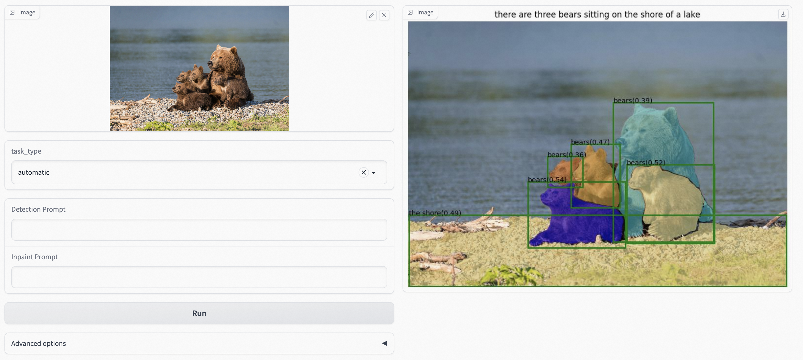

# Grounded-Segment-Anything
We plan to create a very interesting demo by combining [Grounding DINO](https://github.com/IDEA-Research/GroundingDINO) and [Segment Anything](https://github.com/facebookresearch/segment-anything)! Right now, this is just a simple small project. We will continue to improve it and create more interesting demos. And thanks for the community users provide the [colab demo](https://github.com/camenduru/grounded-segment-anything-colab) for us.

We are very willing to **help everyone share and promote new projects** based on Segment-Anything, we highlight some excellent projects here: [Highlight Extension Projects](#bulb-highlight-extension-projects). You can submit a new issue (with `project` tag) or a new pull request to add new projects' links.

**Why this project?**

The **core idea** behind this project is to **combine the strengths of different models in order to build a very powerful pipeline for solving complex problems**. And it's worth mentioning that this is a workflow for combining strong expert models, where **all parts can be used separately or in combination, and can be replaced with any similar but different models (like replacing Grounding DINO with GLIP or other detectors / replacing Stable-Diffusion with ControlNet or GLIGEN/ Combining with ChatGPT)**.

- [Segment Anything](https://github.com/facebookresearch/segment-anything) is a strong segmentation model. But it needs prompts (like boxes/points) to generate masks. 
- [Grounding DINO](https://github.com/IDEA-Research/GroundingDINO) is a strong zero-shot detector which is capable of to generate high quality boxes and labels with free-form text. 
- The combination of `Grounding DINO + SAM` enable to **detect and segment everything at any levels** with text inputs!
- The combination of `BLIP + Grounding DINO + SAM` for **automatic labeling system**!
- The combination of `Grounding DINO + SAM + Stable-diffusion` for **data-factory, generating new data**!
- The combination of `Whisper + Grounding DINO + SAM` to **detect and segment anything with speech**!

**🔥 🔈Speak to edit🎨: Whisper + ChatGPT + Grounded-SAM + SD**


**Grounded-SAM**


**Grounded-SAM + Stable-Diffusion Inpainting: Data-Factory, Generating New Data!**


**BLIP + Grounded-SAM: Automatic Label System!**

Using BLIP to generate caption, extract tags and using Grounded-SAM for box and mask generating. Here's the demo output:


**Imagine Space**

Some possible avenues for future work ...
- Automatic image generation to construct new datasets.
- Stronger foundation models with segmentation pre-training.
- Collaboration with (Chat-)GPT.
- A whole pipeline to automatically label image (with box and mask) and generate new image.

**More Examples**


**Tips**
- If you want to detect multiple objects in one sentence with [Grounding DINO](https://github.com/IDEA-Research/GroundingDINO), we suggest seperating each name with `.` . An example: `cat . dog . chair .`

## :fire: What's New 
- 🆕 Release the interactive fashion-edit playground in [here](https://github.com/IDEA-Research/Grounded-Segment-Anything/tree/humanFace). Run in the notebook, just click for annotating points for further segmentation. Enjoy it! 


  


- :new: Checkout our related human-face-edit branch [here](https://github.com/IDEA-Research/Grounded-Segment-Anything/tree/humanFace). We'll keep updating this branch with more interesting features. Here are some examples:

  


## :bulb: Highlight Extension Projects
- [Zero-Shot Anomaly Detection](https://github.com/caoyunkang/GroundedSAM-zero-shot-anomaly-detection) by Yunkang Cao
- [EditAnything: ControlNet + StableDiffusion based on the SAM segmentation mask](https://github.com/sail-sg/EditAnything) by Shanghua Gao and Pan Zhou
- [IEA: Image Editing Anything](https://github.com/feizc/IEA) by Zhengcong Fei
- [SAM-MMRorate: Combining Rotated Object Detector and SAM](https://github.com/Li-Qingyun/sam-mmrotate) by Qingyun Li and Xue Yang
- [Awesome-Anything](https://github.com/VainF/Awesome-Anything) by Gongfan Fang
- [Prompt-Segment-Anything](https://github.com/RockeyCoss/Prompt-Segment-Anything) by Rockey
- [**WebUi for Segment-Anything! Grounding-SAM is on the way!**](https://github.com/continue-revolution/sd-webui-segment-anything) by Chengsong Zhang
- [Inpainting Anything: Inpaint Anything with SAM + Inpainting models](https://github.com/geekyutao/Inpaint-Anything) by Tao Yu
- [Grounded Segment Anything From Objects to Parts: Combining Segment-Anything with VLPart & GLIP & Visual ChatGPT](https://github.com/Cheems-Seminar/segment-anything-and-name-it) by Peize Sun and Shoufa Chen
- [Narapi-SAM: Integration of Segment Anything into Narapi (A nice viewer for SAM)](https://github.com/MIC-DKFZ/napari-sam) by MIC-DKFZ
- [Grounded Segment Anything Colab](https://github.com/camenduru/grounded-segment-anything-colab) by camenduru


## :bookmark_tabs: Catelog
- [x] Grounding DINO Demo
- [x] Grounding DINO + Segment Anything Demo
- [x] Grounding DINO + Segment Anything + Stable-Diffusion Demo
- [x] BLIP + Grounding DINO + Segment Anything + Stable-Diffusion Demo
- [x] Whisper + Grounding DINO + Segment Anything + Stable-Diffusion Demo
- [ ] Hugging Face Demo
- [ ] Colab demo

## :open_book: Notebook Demo
See our [notebook file](grounded_sam.ipynb) as an example.

## :hammer_and_wrench: Installation
The code requires `python>=3.8`, as well as `pytorch>=1.7` and `torchvision>=0.8`. Please follow the instructions [here](https://pytorch.org/get-started/locally/) to install both PyTorch and TorchVision dependencies. Installing both PyTorch and TorchVision with CUDA support is strongly recommended.

Install Segment Anything:

```bash
python -m pip install -e segment_anything
```

Install Grounding DINO:

```bash
python -m pip install -e GroundingDINO
```


Install diffusers:

```bash
pip install --upgrade diffusers[torch]
```


The following optional dependencies are necessary for mask post-processing, saving masks in COCO format, the example notebooks, and exporting the model in ONNX format. `jupyter` is also required to run the example notebooks.
```
pip install opencv-python pycocotools matplotlib onnxruntime onnx ipykernel
```

More details can be found in [install segment anything](https://github.com/facebookresearch/segment-anything#installation) and [install GroundingDINO](https://github.com/IDEA-Research/GroundingDINO#install)


## :runner: Run Grounding DINO Demo
- Download the checkpoint for Grounding Dino:
```bash
cd Grounded-Segment-Anything

wget https://github.com/IDEA-Research/GroundingDINO/releases/download/v0.1.0-alpha/groundingdino_swint_ogc.pth
```

- Run demo
```bash
export CUDA_VISIBLE_DEVICES=0
python grounding_dino_demo.py \
  --config GroundingDINO/groundingdino/config/GroundingDINO_SwinT_OGC.py \
  --grounded_checkpoint groundingdino_swint_ogc.pth \
  --input_image assets/demo1.jpg \
  --output_dir "outputs" \
  --box_threshold 0.3 \
  --text_threshold 0.25 \
  --text_prompt "bear" \
  --device "cuda"
```
- The model prediction visualization will be saved in `output_dir` as follow:


## :running_man: Run Grounded-Segment-Anything Demo
- Download the checkpoint for Segment Anything and Grounding Dino:
```bash
cd Grounded-Segment-Anything

wget https://dl.fbaipublicfiles.com/segment_anything/sam_vit_h_4b8939.pth
wget https://github.com/IDEA-Research/GroundingDINO/releases/download/v0.1.0-alpha/groundingdino_swint_ogc.pth
```

- Run Demo
```bash
export CUDA_VISIBLE_DEVICES=0
python grounded_sam_demo.py \
  --config GroundingDINO/groundingdino/config/GroundingDINO_SwinT_OGC.py \
  --grounded_checkpoint groundingdino_swint_ogc.pth \
  --sam_checkpoint sam_vit_h_4b8939.pth \
  --input_image assets/demo1.jpg \
  --output_dir "outputs" \
  --box_threshold 0.3 \
  --text_threshold 0.25 \
  --text_prompt "bear" \
  --device "cuda"
```

- The model prediction visualization will be saved in `output_dir` as follow:


## :skier: Run Grounded-Segment-Anything + Inpainting Demo

```bash
CUDA_VISIBLE_DEVICES=0
python grounded_sam_inpainting_demo.py \
  --config GroundingDINO/groundingdino/config/GroundingDINO_SwinT_OGC.py \
  --grounded_checkpoint groundingdino_swint_ogc.pth \
  --sam_checkpoint sam_vit_h_4b8939.pth \
  --input_image assets/inpaint_demo.jpg \
  --output_dir "outputs" \
  --box_threshold 0.3 \
  --text_threshold 0.25 \
  --det_prompt "bench" \
  --inpaint_prompt "A sofa, high quality, detailed" \
  --device "cuda"
```

## :golfing: Run Grounded-Segment-Anything + Inpainting Gradio APP

```bash
python gradio_app.py
```

- The gradio_app visualization as follow:




## :robot: Run Grounded-Segment-Anything + BLIP Demo
It is easy to generate pseudo labels automatically as follows:
1. Use BLIP (or other caption models) to generate a caption.
2. Extract tags from the caption. We use ChatGPT to handle the potential complicated sentences. 
3. Use Grounded-Segment-Anything to generate the boxes and masks.

- Run Demo
```bash
export CUDA_VISIBLE_DEVICES=0
python automatic_label_demo.py \
  --config GroundingDINO/groundingdino/config/GroundingDINO_SwinT_OGC.py \
  --grounded_checkpoint groundingdino_swint_ogc.pth \
  --sam_checkpoint sam_vit_h_4b8939.pth \
  --input_image assets/demo3.jpg \
  --output_dir "outputs" \
  --openai_key your_openai_key \
  --box_threshold 0.25 \
  --text_threshold 0.2 \
  --iou_threshold 0.5 \
  --device "cuda"
```

- The pseudo labels and model prediction visualization will be saved in `output_dir` as follows:


## :open_mouth: Run Grounded-Segment-Anything + Whisper Demo
Detect and segment anything with speech!

**Install Whisper**
```bash
pip install -U openai-whisper
```
See the [whisper official page](https://github.com/openai/whisper#setup) if you have other questions for the installation.

**Run Voice-to-Label Demo**

Optional: Download the demo audio file

```bash
wget https://huggingface.co/ShilongLiu/GroundingDINO/resolve/main/demo_audio.mp3
```


```bash
export CUDA_VISIBLE_DEVICES=0
python grounded_sam_whisper_demo.py \
  --config GroundingDINO/groundingdino/config/GroundingDINO_SwinT_OGC.py \
  --grounded_checkpoint groundingdino_swint_ogc.pth \
  --sam_checkpoint sam_vit_h_4b8939.pth \
  --input_image assets/demo4.jpg \
  --output_dir "outputs" \
  --box_threshold 0.3 \
  --text_threshold 0.25 \
  --speech_file "demo_audio.mp3" \
  --device "cuda"
```


**Run Voice-to-inpaint Demo**

You can enable chatgpt to help you automatically detect the object and inpainting order with `--enable_chatgpt`. 

Or you can specify the object you want to inpaint [stored in `args.det_speech_file`] and the text you want to inpaint with [stored in `args.inpaint_speech_file`].

```bash
# Example: enable chatgpt
export CUDA_VISIBLE_DEVICES=0
export OPENAI_KEY=your_openai_key
python grounded_sam_whisper_inpainting_demo.py \
  --config GroundingDINO/groundingdino/config/GroundingDINO_SwinT_OGC.py \
  --grounded_checkpoint groundingdino_swint_ogc.pth \
  --sam_checkpoint sam_vit_h_4b8939.pth \
  --input_image assets/inpaint_demo.jpg \
  --output_dir "outputs" \
  --box_threshold 0.3 \
  --text_threshold 0.25 \
  --prompt_speech_file assets/acoustics/prompt_speech_file.mp3 \
  --enable_chatgpt \
  --openai_key $OPENAI_KEY \
  --device "cuda"
```

```bash
# Example: without chatgpt
export CUDA_VISIBLE_DEVICES=0
python grounded_sam_whisper_inpainting_demo.py \
  --config GroundingDINO/groundingdino/config/GroundingDINO_SwinT_OGC.py \
  --grounded_checkpoint groundingdino_swint_ogc.pth \
  --sam_checkpoint sam_vit_h_4b8939.pth \
  --input_image assets/inpaint_demo.jpg \
  --output_dir "outputs" \
  --box_threshold 0.3 \
  --text_threshold 0.25 \
  --det_speech_file "assets/acoustics/det_voice.mp3" \
  --inpaint_speech_file "assets/acoustics/inpaint_voice.mp3" \
  --device "cuda"
```


## :cupid: Acknowledgements
- [Segment Anything](https://github.com/facebookresearch/segment-anything)
- [Grounding DINO](https://github.com/IDEA-Research/GroundingDINO)

## Citation
If you find this project helpful for your research, please consider citing the following BibTeX entry.
```BibTex
@article{kirillov2023segany,
  title={Segment Anything}, 
  author={Kirillov, Alexander and Mintun, Eric and Ravi, Nikhila and Mao, Hanzi and Rolland, Chloe and Gustafson, Laura and Xiao, Tete and Whitehead, Spencer and Berg, Alexander C. and Lo, Wan-Yen and Doll{\'a}r, Piotr and Girshick, Ross},
  journal={arXiv:2304.02643},
  year={2023}
}

@inproceedings{ShilongLiu2023GroundingDM,
  title={Grounding DINO: Marrying DINO with Grounded Pre-Training for Open-Set Object Detection},
  author={Shilong Liu and Zhaoyang Zeng and Tianhe Ren and Feng Li and Hao Zhang and Jie Yang and Chunyuan Li and Jianwei Yang and Hang Su and Jun Zhu and Lei Zhang},
  year={2023}
}
```
