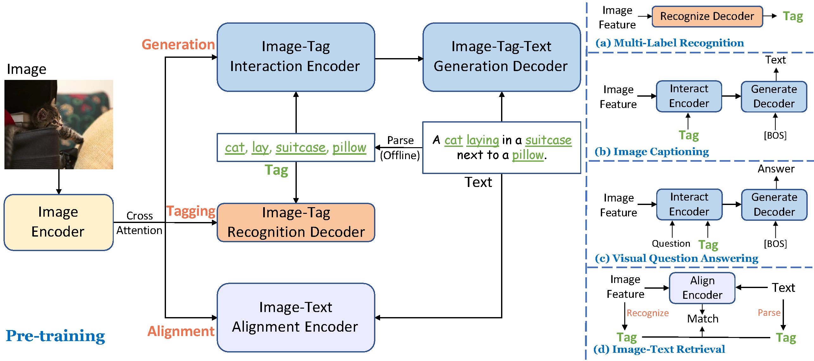

# Tag2Text: Guiding Vision-Language Model via Image Tagging


Official PyTorch Implementation of the <a href="https://arxiv.org/abs/2303.05657">Tag2Text</a>, an efficient and controllable vision-language pre-training framework. Code is available now!

Welcome to try out [Tag2Text Web demo🤗](https://huggingface.co/spaces/xinyu1205/Tag2Text)! Both Tagging and Captioning are included.


## Highlight

- **Tagging.** Without manual annotations, Tag2Text achieves **superior** image tag recognition ability of [**3,429**](./data/tag_list.txt) commonly human-used categories.
- **Efficient.** Tagging guidance effectively enhances the performance of vision-language models on both **generation-based** and **alignment-based** tasks.
- **Controllable.** Tag2Text permits users to input **desired tags**, providing the flexibility in composing corresponding texts based on the input tags.


<p align="center">
 <table class="tg">
  <tr>
    <td class="tg-c3ow"></td>
  </tr>
</table>
</p>

## TODO 

- [x] Release demo.
- [x] Release checkpoints.
- [x] Release inference code.
- [ ] Release training codes.
- [ ] Release training datasets.


## Checkpoints

<!-- insert a table -->
<table>
  <thead>
    <tr style="text-align: right;">
      <th></th>
      <th>name</th>
      <th>backbone</th>
      <th>Data</th>
      <th>Illustration</th>
      <th>Checkpoint</th>
    </tr>
  </thead>
  <tbody>
    <tr>
      <th>1</th>
      <td>Tag2Text-Swin</td>
      <td>Swin-Base</td>
      <td>COCO, VG, SBU, CC-3M, CC-12M</td>
      <td>Demo version with comprehensive captions.</td>
      <td><a href="https://huggingface.co/spaces/xinyu1205/Tag2Text/blob/main/tag2text_swin_14m.pth">Download  link</a></td>
    </tr>
  </tbody>
</table>


## Model Inference

1. Install the dependencies, run:

<pre/>pip install -r requirements.txt</pre> 

2. Download Tag2Text pretrained checkpoints.

3. Get the tagging and captioning results:
<pre/>
python inference.py  --image images/1641173_2291260800.jpg \
--pretrained pretrained/tag2text_swin_14m.pth
</pre>
Or get the tagging and sepcifed captioning results (optional):
<pre/>python inference.py  --image images/1641173_2291260800.jpg \
--pretrained pretrained/tag2text_swin_14m.pth \
--specified-tags "cloud,sky"</pre>

## Credit to previous work
This work is done with the help of the amazing code base of [BLIP](https://github.com/salesforce/BLIP), thanks very much!


## Citation
If you find our work to be useful for your research, please consider citing.

```
@article{huang2023tag2text,
  title={Tag2Text: Guiding Vision-Language Model via Image Tagging},
  author={Huang, Xinyu and Zhang, Youcai and Ma, Jinyu and Tian, Weiwei and Feng, Rui and Zhang, Yuejie and Li, Yaqian and Guo, Yandong and Zhang, Lei},
  journal={arXiv preprint arXiv:2303.05657},
  year={2023}
}
```


