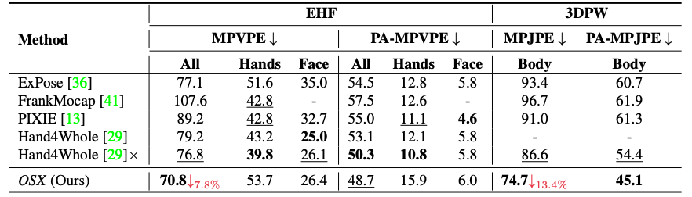
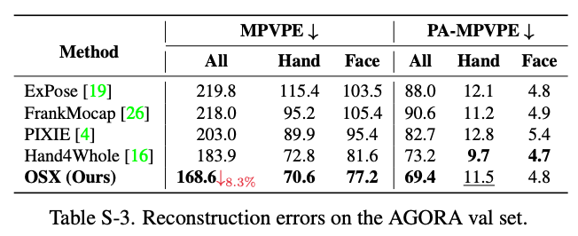

# **One-Stage 3D Whole-Body Mesh Recovery with Component Aware Transformer**
### [Project Page](https://osx-ubody.github.io/) | [Video](https://osx-ubody.github.io/) | [Paper](http://arxiv.org/abs/2303.16160) | [Data](https://osx-ubody.github.io/)
#### Authors

[Jing Lin](https://github.com/linjing7), [Ailing Zeng](https://ailingzeng.site/), [Haoqian Wang](https://www.sigs.tsinghua.edu.cn/whq_en/main.htm), [Lei Zhang](https://www.leizhang.org/), [Yu Li](https://yu-li.github.io/)

<p align="middle">

<br>
<em>The proposed UBody dataset</em>
</p>


## 1. Introduction  
This repo is official **[PyTorch](https://pytorch.org)** implementation of [One-Stage 3D Whole-Body Mesh Recovery with Component Aware Transformer (CVPR2023)](https://osx-ubody.github.io/). We propose the first one-stage whole-body mesh recovery method (OSX) and build a large-scale upper-body dataset (UBody). It is the top-1 method on [AGORA benchmark](https://agora-evaluation.is.tuebingen.mpg.de/) SMPL-X Leaderboard (dated March 2023).

## 2. Create Environment  

- [PyTorch >= 1.7](https://pytorch.org/) + [CUDA](https://developer.nvidia.com/cuda-downloads)

  Recommend to install by:

  ```shell
  pip install torch==1.11.0+cu113 torchvision==0.12.0+cu113 torchaudio==0.11.0 --extra-index-url https://download.pytorch.org/whl/cu113
  ```

- Python packages:

  ```shell
  pip install -r requirements.txt
  ```

- mmcv-full:

  ```shell
  pip install openmim
  mim install mmcv-full==1.7.1
  ```

- mmpose:

  ```shell
  cd main/transformer_utils
  python setup.py develop
  ```

## 3. Quick demo  

* Slightly change `torchgeometry` kernel code following [here](https://github.com/mks0601/I2L-MeshNet_RELEASE/issues/6#issuecomment-675152527).
* Download the pre-trained OSX from [here](https://drive.google.com/drive/folders/1x7MZbB6eAlrq5PKC9MaeIm4GqkBpokow?usp=share_link).
* Prepare `input.png` and pre-trained snapshot at `demo` folder.
* Prepare `human_model_files` folder following below `Directory` part and place it at `common/utils/human_model_files`.
* Go to any of `main` folders and edit `bbox` of `demo.py` .
* Run `python demo.py --gpu 0`.
* If you run this code in ssh environment without display device, do follow:
```
1、Install oemesa follow https://pyrender.readthedocs.io/en/latest/install/
2、Reinstall the specific pyopengl fork: https://github.com/mmatl/pyopengl
3、Set opengl's backend to egl or osmesa via os.environ["PYOPENGL_PLATFORM"] = "egl"
```

## 4. Directory  
### (1) Root  
The `${ROOT}` is described as below.  
```  
${ROOT}  
|-- data  
|-- dataset
|-- demo
|-- main  
|-- pretrained_models
|-- tool
|-- output  
|-- common
|   |-- utils
|   |   |-- human_model_files
|   |   |   |-- smpl
|   |   |   |   |-- SMPL_NEUTRAL.pkl
|   |   |   |-- smplx
|   |   |   |   |-- MANO_SMPLX_vertex_ids.pkl
|   |   |   |   |-- SMPL-X__FLAME_vertex_ids.npy
|   |   |   |   |-- SMPLX_NEUTRAL.pkl
|   |   |   |   |-- SMPLX_to_J14.pkl
|   |   |   |-- mano
|   |   |   |   |-- MANO_LEFT.pkl
|   |   |   |   |-- MANO_RIGHT.pkl
|   |   |   |-- flame
|   |   |   |   |-- flame_dynamic_embedding.npy
|   |   |   |   |-- flame_static_embedding.pkl
|   |   |   |   |-- FLAME_NEUTRAL.pkl
```
* `data` contains data loading codes.  
* `dataset` contains soft links to images and annotations directories.  
* `pretrained_models` contains pretrained models.  
* `demo` contains demo codes.
* `main` contains high-level codes for training or testing the network.  
* `tool` contains pre-processing codes of AGORA and pytorch model editing codes.
* `output` contains log, trained models, visualized outputs, and test result.  
* `common` contains kernel codes for Hand4Whole.  
* `human_model_files` contains `smpl`, `smplx`, `mano`, and `flame` 3D model files. Download the files from [[smpl]](https://smpl.is.tue.mpg.de/) [[smplx]](https://smpl-x.is.tue.mpg.de/) [[SMPLX_to_J14.pkl]](https://github.com/vchoutas/expose#preparing-the-data) [[mano]](https://mano.is.tue.mpg.de/) [[flame]](https://flame.is.tue.mpg.de/).
### (2) Data  
You need to follow directory structure of the `dataset` as below.  
```  
${ROOT}  
|-- dataset  
|   |-- AGORA
|   |   |-- data
|   |   |   |-- AGORA_train.json
|   |   |   |-- AGORA_validation.json
|   |   |   |-- AGORA_test_bbox.json
|   |   |   |-- 1280x720
|   |   |   |-- 3840x2160
|   |-- EHF
|   |   |-- data
|   |   |   |-- EHF.json
|   |-- Human36M  
|   |   |-- images  
|   |   |-- annotations  
|   |-- MPII
|   |   |-- data
|   |   |   |-- images
|   |   |   |-- annotations
|   |-- MPI_INF_3DHP
|   |   |-- data
|   |   |   |-- images_1k
|   |   |   |-- MPI-INF-3DHP_1k.json
|   |   |   |-- MPI-INF-3DHP_camera_1k.json
|   |   |   |-- MPI-INF-3DHP_joint_3d.json
|   |   |   |-- MPI-INF-3DHP_SMPL_NeuralAnnot.json
|   |-- MSCOCO  
|   |   |-- images  
|   |   |   |-- train2017  
|   |   |   |-- val2017  
|   |   |-- annotations 
|   |-- PW3D
|   |   |-- data
|   |   |   |-- 3DPW_train.json
|   |   |   |-- 3DPW_validation.json
|   |   |   |-- 3DPW_test.json
|   |   |-- imageFiles

```

* Download AGORA parsed data [[data](https://drive.google.com/drive/folders/18CWsL28e8v50rqEbYMoU4yHHWoGJdpg_?usp=sharing)][[parsing codes](tool/AGORA)]
* Download EHF parsed data [[data](https://drive.google.com/file/d/1Ji2PuB2HYQzRpQ016LwSSLguFMezQqOI/view?usp=sharing)]
* Download Human3.6M parsed data and SMPL-X parameters [[data](https://drive.google.com/drive/folders/1r0B9I3XxIIW_jsXjYinDpL6NFcxTZart?usp=sharing)][[SMPL-X parameters from NeuralAnnot](https://drive.google.com/drive/folders/19ifIQtAB3ll8d37-kerL1eQWp31mOwJM?usp=sharing)]
* Download MPII parsed data and SMPL-X parameters [[data](https://drive.google.com/drive/folders/1rrL_RxhwQgwhq5BU1iIRPwl285B_KTpU?usp=sharing)][[SMPL-X parameters from NeuralAnnot](https://drive.google.com/file/d/1alkKvhkqQGqriKst83uS-kUG7v6SkM7W/view?usp=sharing)]
* Download MPI-INF-3DHP parsed data and SMPL-X parameters [[data](https://drive.google.com/drive/folders/1wQbHEXPv-WH1sNOLwdfMVB7OWsiJkq2M?usp=sharing)][[SMPL-X parameters from NeuralAnnot](https://drive.google.com/file/d/1ADOJlaqaBDjZ3IEgrgLTQwNf6iHd-rGH/view?usp=sharing)]
* Download MSCOCO data and SMPL-X parameters [[data](https://github.com/jin-s13/COCO-WholeBody)][[SMPL-X parameters from NeuralAnnot](https://drive.google.com/file/d/1RVJiI2Y1TjiAPcRnDZk5CX5L7Vehfinm/view?usp=sharing)]
* Download 3DPW parsed data [[data](https://drive.google.com/drive/folders/1HByTBsdg_A_o-d89qd55glTl44ya3dOs?usp=sharing)]
* All annotation files follow [MSCOCO format](http://cocodataset.org/#format-data). If you want to add your own dataset, you have to convert it to [MSCOCO format](http://cocodataset.org/#format-data).  
  
### (3) Output  
You need to follow the directory structure of the `output` folder as below.  
```  
${ROOT}  
|-- output  
|   |-- log  
|   |-- model_dump  
|   |-- result  
|   |-- vis  
```
* Creating `output` folder as soft link form is recommended instead of folder form because it would take large storage capacity.  
* `log` folder contains training log file.  
* `model_dump` folder contains saved checkpoints for each epoch.  
* `result` folder contains final estimation files generated in the testing stage.  
* `vis` folder contains visualized results.  


## 5. Training OSX
#### (1) Download Pretrained Encoder

Download pretrained encoder `osx_vit_l.pth` and `osx_vit_b.pth` from [here](https://drive.google.com/drive/folders/1x7MZbB6eAlrq5PKC9MaeIm4GqkBpokow?usp=share_link) and place the pretrained model to `pretrained_models/`.

#### (2) Train on MSCOCO, Human3.6m, MPII and Test on EHF and AGORA-val

In the `main` folder, run  
```bash  
python train.py --gpu 0,1,2,3 --lr 1e-4 --exp_name output/train_setting1 --end_epoch 14 --train_batch_size 16
```
After training, run the following command to evaluate your pretrained model on EHF and AGORA-val:

```bash  
# test on EHF
python test.py --gpu 0,1,2,3 --exp_name output/train_setting1/ --pretrained_model_path ../output/train_setting1/model_dump/snapshot_13.pth --testset EHF
# test on AGORA-val
python test.py --gpu 0,1,2,3 --exp_name output/train_setting1/ --pretrained_model_path ../output/train_setting1/model_dump/snapshot_13.pth --testset AGORA
```
To speed up, you can use a light-weight version OSX by change the encoder setting by adding `--encoder_setting osx_b` or change the decoder settiing by adding `--decoder_setting wo_face_decoder`
#### (3) Train on AGORA and Test on AGORA-test

In the `main` folder, run  

```bash  
python train.py --gpu 0,1,2,3 --lr 1e-4 --exp_name output/train_setting2 --end_epoch 140 --train_batch_size 16  --agora_benchmark --decoder_setting wo_decoder
```

After training, run the following command to evaluate your pretrained model on AGORA-test:

```bash  
python test.py --gpu 0,1,2,3 --exp_name output/train_setting2/ --pretrained_model_path ../output/train_setting2/model_dump/snapshot_139.pth --testset AGORA --agora_benchmark --test_batch_size 64 --decoder_setting wo_decoder
```

The reconstruction result will be saved at `output/train_setting2/result/`.

You can zip the `predictions` folder into `predictions.zip` and submit it to the [AGORA benchmark](https://agora-evaluation.is.tuebingen.mpg.de/) to obtain the evaluation metrics. 

You can use a light-weight version OSX by adding `--encoder_setting osx_b`.

## 6. Testing OSX

#### (1) Download Pretrained Models

Download pretrained models `osx_l.pth.tar` and `osx_l_agora.pth.tar` from [here](https://drive.google.com/drive/folders/1x7MZbB6eAlrq5PKC9MaeIm4GqkBpokow?usp=share_link) and place the pretrained model to `pretrained_models/`.

#### (2) Test on EHF

In the `main` folder, run  

```bash  
python test.py --gpu 0,1,2,3 --exp_name output/test_setting1 --pretrained_model_path ../pretrained_models/osx_l.pth.tar --testset EHF
```

#### (3) Test on AGORA-val

In the `main` folder, run  

```bash  
python test.py --gpu 0,1,2,3 --exp_name output/test_setting1 --pretrained_model_path ../pretrained_models/osx_l.pth.tar --testset AGORA
```

#### (4) Test on AGORA-test

In the `main` folder, run  

```bash  
python test.py --gpu 0,1,2,3 --exp_name output/test_setting2  --pretrained_model_path ../pretrained_models/osx_l_agora.pth.tar --testset AGORA --agora_benchmark --test_batch_size 64
```

The reconstruction result will be saved at `output/test_setting2/result/`.

You can zip the `predictions` folder into `predictions.zip` and submit it to the [AGORA benchmark](https://agora-evaluation.is.tuebingen.mpg.de/) to obtain the evaluation metrics. 
## 7. Results

### (1) AGORA test set


### (2) AGORA-val, EHF, 3DPW







### Troubleshoots

* `RuntimeError: Subtraction, the '-' operator, with a bool tensor is not supported. If you are trying to invert a mask, use the '~' or 'logical_not()' operator instead.`: Go to [here](https://github.com/mks0601/I2L-MeshNet_RELEASE/issues/6#issuecomment-675152527)

* `TypeError: startswith first arg must be bytes or a tuple of bytes, not str.`: Go to [here](https://github.com/mcfletch/pyopengl/issues/27)

### Acknowledgement

This repo is mainly based on [Hand4Whole](https://github.com/mks0601/Hand4Whole_RELEASE). We thank the well-organized code and patient answers of [Gyeongsik Moon](https://mks0601.github.io/) in the issue!

## Reference  

```  
@article{lin2023osx,
  author    = {Lin, Jing and Zeng, Ailing and Wang, Haoqian and Zhang, Lei and Li, Yu},
  title     = {One-Stage 3D Whole-Body Mesh Recovery with Component Aware Transformer},
  journal   = {CVPR},
  year      = {2023},
}
```
