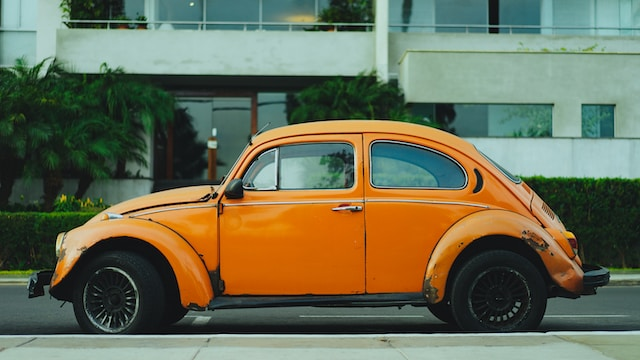

## ImageBind with SAM

This is an experimental demo aims to combine [ImageBind](https://github.com/facebookresearch/ImageBind) and [SAM](https://github.com/facebookresearch/segment-anything) to generate mask **with different modalities**.

This basic idea is followed with [IEA: Image Editing Anything](https://github.com/feizc/IEA) and [CLIP-SAM](https://github.com/maxi-w/CLIP-SAM) which generate the referring mask with the following steps:

- Step 1: Generate auto masks with `SamAutomaticMaskGenerator`
- Step 2: Crop all the box region from the masks
- Step 3: Compute the similarity with cropped images and different modalities
- Step 4: Merge the highest similarity mask region

## Table of contents
- [Installation](#installation)
- [ImageBind-SAM Demo](#run-the-demo)
- [Audio Referring Segment](#run-audio-referring-segment-demo)
- [Text Referring Segment](#run-text-referring-segment-demo)
- [Image Referring Segment](#run-image-referring-segmentation-demo)


## Installation
- Download the pretrained checkpoints

```bash
cd playground/ImageBind_SAM

mkdir .checkpoints
cd .checkpoints

# download imagebind weights
wget https://dl.fbaipublicfiles.com/imagebind/imagebind_huge.pth
wget https://dl.fbaipublicfiles.com/segment_anything/sam_vit_h_4b8939.pth
```

- Install ImageBind follow the [official installation guidance](https://github.com/facebookresearch/ImageBind#usage).
- Install Grounded-SAM follow [install Grounded-SAM](https://github.com/IDEA-Research/Grounded-Segment-Anything#installation).


## Run the demo
```bash
python demo.py
```

We implement `Text Seg` and `Audio Seg` in this demo, the generate masks will be saved as `text_sam_merged_mask.jpg` and `audio_sam_merged_mask.jpg`:

<div align="center">

| Input Model | Modality | Generate Mask |
|:----:|:----:|:----:|
|  | [car audio](./.assets/car_audio.wav) |  |
|  | "A car" |  |
|  | <div style="text-align: center"> </div> |  |


</div>

By setting different threshold may influence a lot on the final results.

## Run image referring segmentation demo
```bash
# download the referring image
cd .assets
wget https://github.com/IDEA-Research/detrex-storage/releases/download/grounded-sam-storage/referring_car_image.jpg
cd ..

python image_referring_seg_demo.py
```

## Run audio referring segmentation demo
```bash
python audio_referring_seg_demo.py
```

## Run text referring segmentation demo
```bash
python text_referring_seg_demo.py
```